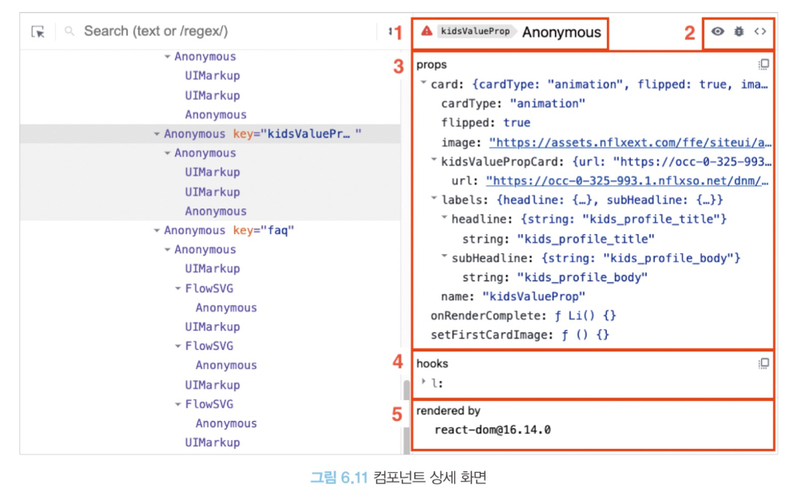

# 06장 | 리액트 개발 도구로 디버깅하기
## 6.1 리액트 개발 도구란?
* 리액트 팀은 개발 도구인 react-dev-tools를 만들어 제공
* 개발 도구는 리액트로 만들어진 다양한 애플리케이션을 디버깅하기 위해 만들어졌다.
* 웹 개발 환경에서 개발 도구를 사용하는 가장 편리한 방법은 브라우저 확장 프로그램을 사용하는 것이다. 
## 6.2 리액트 개발 도구 설치
브라우저에 리액트 개발 도구를 브라우저 확장 도구로 설치해야 한다.(책에서는 크롬 확장 프로그램을 기준으로 설명)  
정상적으로 개발 도구가 설치 되면 리액트 개발자 도구 아이콘에 빨간색으로 표시된다.
## 6.3 리액트 개발 도구 활용하기
리액트 개발 도구가 정상적으로 설치되면 크롬 개발자 도구에 Components와 Profiler 메뉴가 추가된다.
두 메뉴를 사용하면 리액트 애플리케이션에서 일어나는 대부분의 작동을 확인해 볼 수 있다.
### 6.3.1 컴포넌트
Components 탭에서는 현재 리액트 애플리케이션의 컴포넌트 트리를 확인할 수 있다.
##### 컴포넌트 트리
트리 구조로 구성되며 리액트 애플리케이션 전체의 트리 구조를 한눈에 보여준다.  
기명함수로 선언되면 해당 컴포넌트명을 보여주고, 익명 함수로 선언돼 있다면 Anonymous라는 이름으로 컴포넌트를 보여준다.  
</img>

```java
import AnonymousDefaultComponent from './Component3'

function Component1() {
    return <>Component1</>
}

const Component2 = () => {
    return <>Component2</>
}

const MemorizedComponent = memo(() => <>MemorizedComponent</>)

const withSampleHOC = (Component: ComponentType) => {
    return function () {
        return <Component />
    }
}

export default function App() {
    return (
        <div className = "App">
            <Component1 />
            <Component2 />
            <AnonymousDefaultComponent />
            <MemorizedComponent />
            <HOCComponenet />
        </div>
    )
}

export default () => {
    return <>Component3</>
}
```

* 함수 선언식과 함수 표현식으로 생성한 컴포넌트는 모두 정상적으로 함수명을 표시한다.
* 그렇지 않은 경우
  - 익명 함수를 default로 export한 AnonymousDefaultComponent의 경우에는 코드 내부에서 사용되는 이름일 뿐 실제로 default export로 내보낸 함수의 명칭은 추론할 수 없다. 
  - memo를 사용해 익명 함수로 만든 컴포넌트를 감싼 경우 함수명을 명확히 추론하지 못해서 Anonymous로 표시된다. 
  - 고차 컴포넌트로 감싼 HOCComponent의 경우 Anonymous로 선언된다.
* 이는 리액트 16.8 버전의 내용으로, 익명 함수에 대해 컴포넌트 명칭을 제대로 추론하지 못하는데 16.9 버전 이후부터는 문제가 일부 해결됐다.
* 그럼에도 개발 도구에서 컴포넌트를 특정하기 어렵다.
  - 이를 해결하기 위한 방법 중 하나로 컴포넌트를 기명 함수로 변경하는 방법이 있다.
```java
const MemorizedComponent = memo(function MemorizedComponent() {
    return <>MemorizedComponent</>
})

const withSampleHOC = (Component: ComponentType) => {
    return function withSampleHOC() {
        return <Component />
    }
}

const HOCComponent = withSampleHOC(function HOCComponent() {
    return <>HOCComponent</>
}) 
```
  - 함수를 기명 함수로 바꾸기 어려운 경우 함수에 displayName 속성을 추가하는 방법이 있다.
```java
const MemorizedComponent = memo(function () {
    return <>MemorizedComponent</>
})

MemorizedComponent.displayName = '메모 컴포넌트입니다.'
```

##### 컴포넌트명과 props
컴포넌트 트리에서 컴포넌트를 선택했을 때 해당 컴포넌트에 대한 자세한 정보를 보여주는 영역
</img> 

##### 컴포넌트명과 Key
컴포넌트의 명칭과 해당 컴포넌트를 나타낸다.
* 위와같은 경우 컴포넌트 명칭은 Anonymous이며 Key는 KidsValueProps이다. 
* 빨간색 경고 이모티콘은 해당 애플리케이션이 strict mode로 렌더링되지 않았다는 것을 의미한다.

##### 컴포넌트 도구
컴포넌트 도구에는 3개의 아이콘이 있다.
1. 첫 번째 눈 아이콘을 누르면 요소 탭으로 이동하며, 해당 컴포넌트가 렌더링한 HTML 요소가 선택되는 것을 볼 수 있다.
2. 두 번째 벌레 아이콘을 클릭하면 콘솔탭에 해당 컴포넌트의 정보가 기록된다. 컴포넌트가 받는 props, hooks, nodes가 기록되며, 개발 도구 화면에서 보기에는 복잡한 정보를 확인하거나 해당 정보를 복사하는 등의 용도로 쓰인다.
3. 세 번째 소스코드 아이콘을 클릭하면 컴포넌트의 소스코드를 확인할 수 있다.
    소스코드가 프로덕션 모드에서 빌드되어 최대로 압축돼 있는 경우 왼쪽 하단의 {}를 클릭하면 난독화된 코드를 읽어준다.  
    {} 버튼은 난독화된 코드를 읽고, 디버깅 할 때 매우 유용하게 사용할 수 있다.
##### 컴포넌트 props
* 해당 컴포넌트가 받은 props를 확인할 수 있다.
* 마우스 오른쪽 버튼을 클릭하고 'Copy value to clipboard'를 누르면 클립보드로 복사되고, 'Store as global variable' 버튼을 누르면 window.$r에 해당 정보가 담긴다.
* 값이 함수인 porps를 누르면 Go to definition이 나타나고, 이를 클릭하면 해당 함수가 선언된 코드로 이동한다. 값을 더블클릭하면 내용을 수정 할 수 있다.

##### 컴포넌트 hooks
* 컴포넌트에서 사용 중인 훅 정보를 확인할 수 있다.
    리액트 개발자 도구에서 볼 수 있는 훅 목록
    State:useState
    Reducer:useReducer
    Context:useContext
    Memo:useMemo
    Callback:useCallback
    Ref:useRef
    id:useId
    LayoutEffect:useLayoutEffect
    Effect:useEffect
* 리액트에서 정의되지 않은 명칭이 보인다면 이는 사용자 정의 훅이다.
* hooks도 props 처럼 값을 더블클릭하면 해당 값을 수정할 수 있다.
* 훅에 넘겨주는 함수를 기명 함수로 넘겨주면 실행되는 함수의 이름을 확인할 수 있다.
```java
//before
useEffect(() => {
    console.log('useEffect')
})
//after
useEffect(() => {
    console.log('useEffect')
})
```
##### 컴포넌트를 렌더링한 주체, rendered by
해당 컴포넌트를 렌더링한 주체가 누구인지 확인할 수 있다.  

### 6.3.2 프로파일러
* 리액트가 렌더링하는 과정에서 발생하는 상황을 확인하기 위한 도구
* 프로파일러 메뉴가 어떻게 작동하는지 확인하고 싶다면 개발 모드로 실행되는 리액트 애플리케이션을 준비해야 한다.
##### 설정 변경하기
* General 탭의 Highlight updates when components render:컴포넌트가 렌더링될 때마다 해당 컴포넌트에 하이라이트 표시
* Debugging 탭의 Hide logs during second render in Strict Mode:리액트 애플리케이션이 엄격 모드에서 실행되는 경우 useEffect 안의 console.log가 두 번씩 찍히는 것을 막고 싶을 때 사용
* Profiler 탭의 Record why each component rendered while profiling:프로파일링 도중 무엇 때문에 컴포넌트가 렌더링됐는지 기록

##### 프로파일링
###### 프로파일링 메뉴
리액트가 렌더링할 때 어떠한 일이 벌어지는지 확인할 수 있는 도구
1. Start Prifiling (프로파일링 시작 버튼) : 프로파일링 시작
2. Reload and Start profiling (새로고침 후 프로파일링 시작) : 웹페이지가 새로고침되면서 이와 동시에 프로파일링 시작
3. Stop Profiling(프로파일링 종료 버튼) : 프로파일링된 현재 내용을 모두 삭제
4. Load Profile(프로파일 블러오기) & Save Profile(프로파일 저장하기) : 프로파일링 결과를 저장하고 불러옴
###### Flamegraph
* 렌더 커밋별로 어떠한 작업이 일어났는지 나타냄
* 너비가 넓을수록 렌더링하는 데 오래 걸림을 의미
* 루트 컴포넌트는 모든 컴포넌트를 렌더링해야 하므로 렌더링이 가장 오래걸린다.
* 각 컴포넌트에 마우스 커서를 가져다 대면 해당 컴포넌트의 렌더링과 관련된 정보를 확인할 수 있다.
     - 렌더링되지 않은 컴포넌트는 회색으로 표시된다.

###### Ranked
해당 커밋에서 렌더링하는 데 오랜 시간이 걸린 컴포넌트를 순서대로 나열한 그래프  
Flamegraph 와의 차이점 -> 모든 컴포넌트를 보여주는 게 아니라 렌더링이 발생한 컴포넌트만 보여줌

###### 타임라인
* 시간이 지남에 따라 컴포넌트에서 어떤 일이 일어났는지 확인  
* 시간의 흐름에 따라 리액트가 작동하는 내용을 추적하는 데 유용하다.

### 6.4 정리
리액트 개발 도구를 활용하면 정적으로 생성된 컴포넌트 트리를 보는 것에서부터 프로파일링을 통해 리액트 애플리케이션이 시간이 지남에 따라 어떤 식으로 작동하는지, 불필요한 리렌더링이 일어나고 있는지 등을 확인할 수 있다.