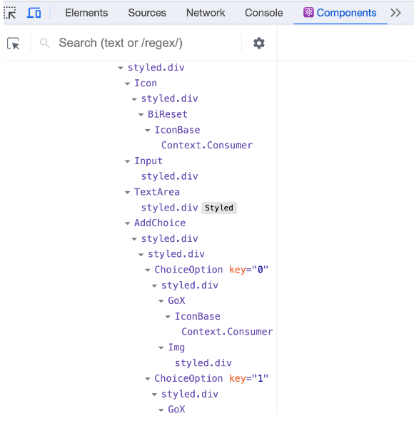

# 06장 | 리액트 개발 도구로 디버깅하기
## 6.1 리액트 개발 도구란?
* 리액트 팀은 개발 도구인 react-dev-tools를 만들어 제공
* 개발 도구는 리액트로 만들어진 다양한 애플리케이션을 디버깅하기 위해 만들어졌다.
* 웹 개발 환경에서 개발 도구를 사용하는 가장 편리한 방법은 브라우저 확장 프로그램을 사용하는 것이다. 
## 6.2 리액트 개발 도구 설치
브라우저에 리액트 개발 도구를 브라우저 확장 도구로 설치해야 한다. 
    책에서는 크롬 확장 프로그램을 기준으로 설명  
    리액트 개발자 도구 아이콘에 빨간색으로 표시되어야 한다.
## 6.3 리액트 개발 도구 활용하기
리액트 개발 도구가 정상적으로 설치되면 크롬 개발자 도구에 Components와 Profiler 메뉴가 추가된다.
두 메뉴를 사용하면 리액트 애플리케이션에서 일어나는 대부분의 작동을 확인해 볼 수 있다.
### 6.3.1 컴포넌트
Components 탭에서는 현재 리액트 애플리케이션의 컴포넌트 트리를 확인할 수 있다.
##### 컴포넌트 트리
트리 구조로 구성되며 리액트 애플리케이션 전체의 트리 구조를 한눈에 보여준다.
</img>