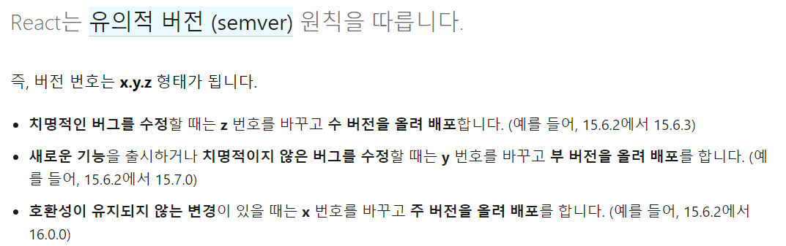
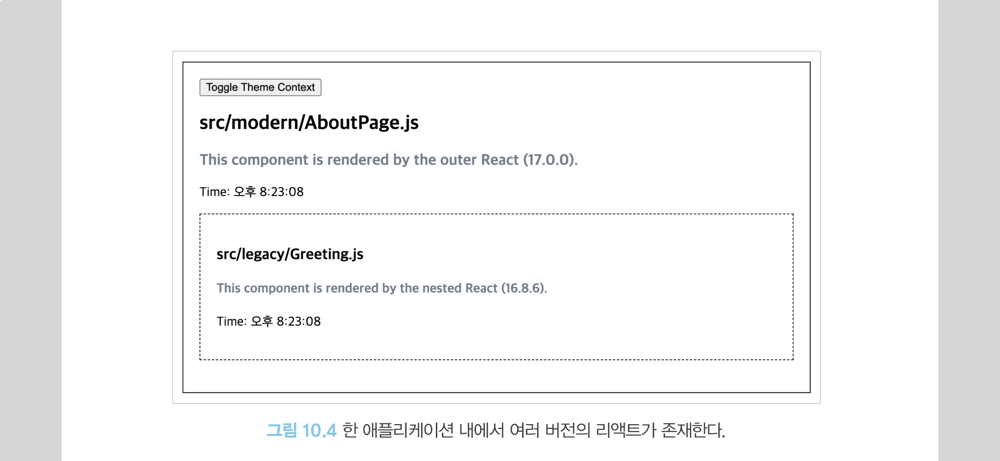
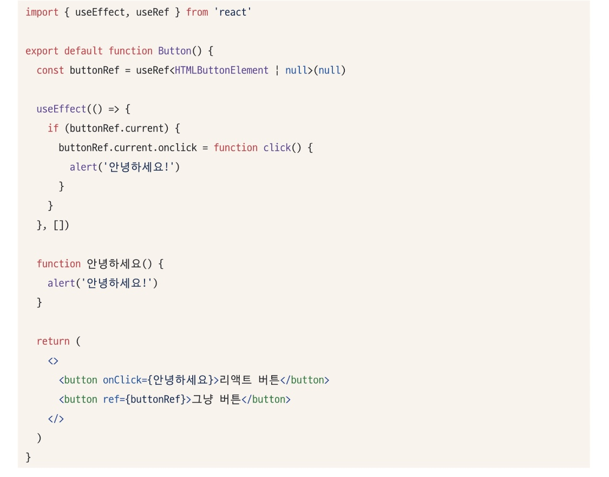
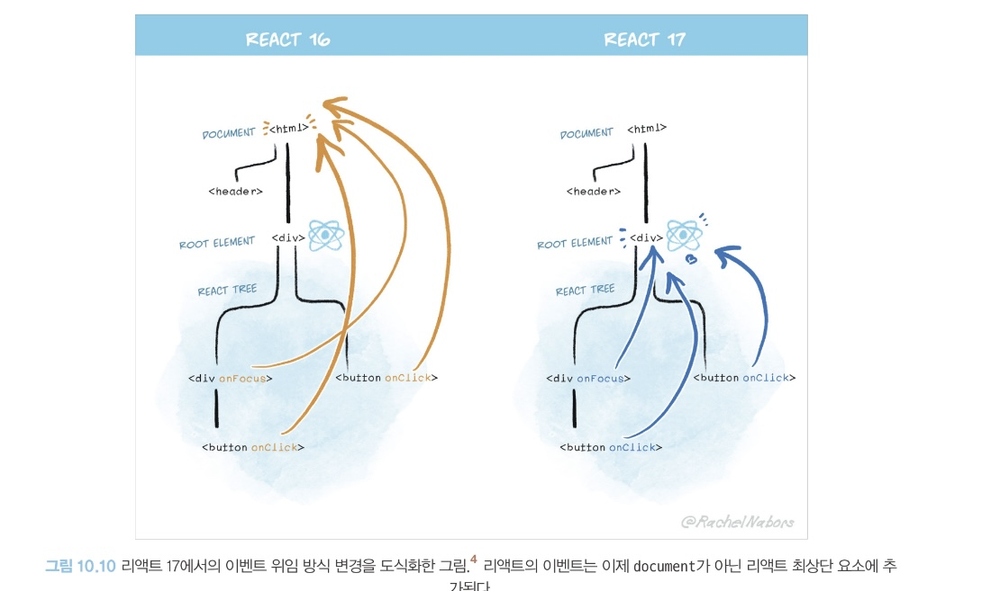
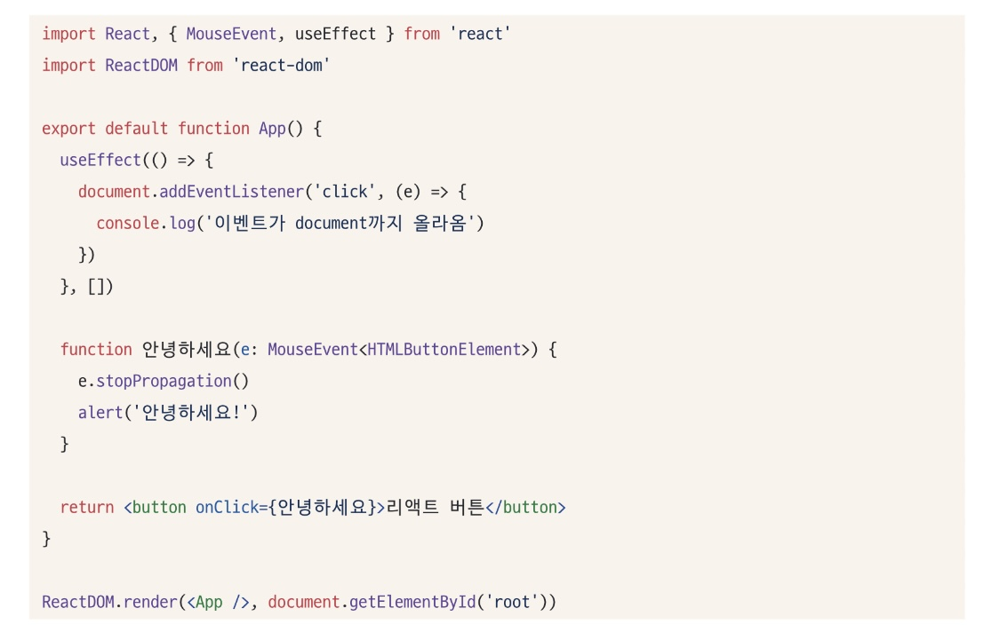
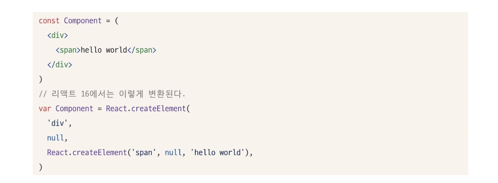
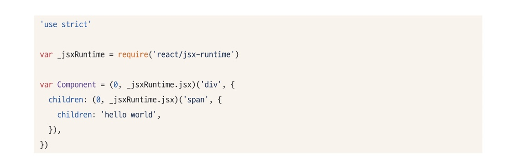
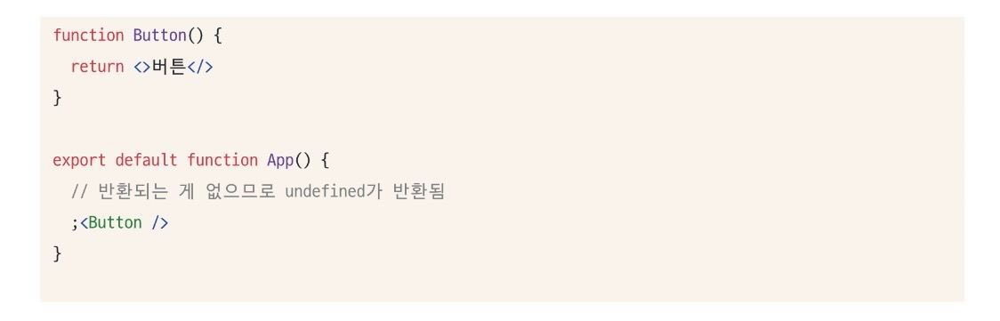

# 10장|리액트 17과 18의 변경 사항 살펴보기
리액트가 제공하는 최신 기능을 모두 활용하려면 리액트가 제공하는 새로운 버전을 따라잡을 필요가 있다.  
이번 장에서는 리액트 17과 18 버전에 어떠한 변화가 있었는지 살펴보고자 한다.  
## 10.1 리액트 17 버전 살펴보기
리액트 17버전은 16버전과 다르게 새롭게 추가된 기능이 없으며 호환성이 깨지는 변경 사항을 최소화했다는 점을 가장 큰 특징으로 꼽는다.  
16 버전에서 17 버전으로의 버전 업은 큰 부담 없이 할 수 없는 작업이라 볼 수 있다.  
### 10.1.1 리액트의 점진적인 업그레이드
</img>   

* 리액트는 유의적 버전을 기반으로 업데이트를 거치고 있다.
* 리액트 16에서 17로의 업데이트는 16에서 호환되지 않는 API가 있거나 17을 사용하는 데 있어 이전과 작동 방식이 달라질 수 있기 때문에 단행된 주 버전 업데이트다.
* 주 버전이 릴리스되면 이전 버전에서의 API 제공을 중당하고 전체 애플리케이션을 새롭게 업그레이드하기를 요구했으나, 이제 17 버전부터는 점진적인 업그레이드가 가능해진다.
* 즉, 18로 업데이트 하는 상황에 경우 전체 애플리케이션 트리는 리액트 17이지만 일부 트리와 컴포넌트에 대해서만 리액트 18을 선택하는 점진적인 버전 업이 가능해진다.  
* 향후 업데이트가 부담된다 하더라도 17버전부터 제공되는 점진적인 업그레이드를 사용하기 위해 17 버전 업데이트를 고려해 봄 직하다.
</img>   

리액트 16과 17 버전을 모두 지원하는 컴포넌트나 훅이라면 버전이 다른 두 리액트에서도 사용 가능하다.  
리액트 17은 내부에서 리액트 16을 게으르게 불러온다.  
리액트 16을 위한 별도의 루트 요소를 만들고, 여기에 불러온 리액트 16 모듈을 렌더링하는 구조로 구성돼 있다.  
이렇게 불러온 결과, 서로 렌더링하는 과정에서 버전의 불일치로 인한 에러도 발생하지 않고 하나의 웹사이트에서 두 개의 리액트가 존재하게 된다.  

### 10.1.2 이벤트 위임 방식의 변경
</img> 

* 리액트 버튼 : 리액트 애플리케이션에서 DOM에 이벤트를 추가하는 방식으로 onclick 이벤트를 추가했다.
* 그냥 버튼 : 직접 DOM을 참조해서 가져온 다음, DOM의 onclick에 직접 함수를 추가하는 고전적인 이벤트 핸들러 추가 방식을 사용했다.  
웹에서 이 두 가지를 보면 '그냥 버튼'은 이벤트 리스너에 click으로 추가돼 있고, '리액트 버튼'은 <button>의 onClick이벤트에 noop이라는 핸들러가 추가돼 있는 것을 볼 수 있다.  

#### 리액트에서는 이벤트를 어떻게 처리할까?
리액트는 이벤트 핸들러를 해당 이벤트 핸들러를 추가한 각각의 DOM 요소에 부착하는 것이 아니라, 이벤트 타입(click, change)당 하나의 핸들러를 루트에 부착한다.  
이를 이벤트 위임이라고 한다.  

#### 이벤트가 어떤 단계로 구성돼 있을까?
1. 캡처 : 이벤트 핸들러가 트리 최상단 요소에서 부터 시작해서 실제 이벤트가 발생한 타깃 요소까지 내려가는 것
2. 타깃 : 이벤트 핸들러가 타깃 노드에 도달하는 단계로, 이 단계에서 이벤트가 호출된다.  
3. 버블링 : 이벤트가 발생한 요소에서부터 시작해 최상위 요소까지 다시 올라간다.

#### 이벤트 위임이란?
</img> 

이벤트 위임 : 이벤트 단계의 원리를 활용해 이벤트를 상위 컴포넌트에만 붙이는 것으로 이를 통해 많은 이점을 얻을 수 있다.  
이러한 이벤트 위임이 리액트 16버전까지는 모두 document에서 수행되고 있었다.  
그러나 리액트 17부터는 점진적인 업그레이드 지원, 그리고 다른 바닐라 자바스크립트 코드 등이 혼재돼 있는 경우 혼란을 방지하기 위해 이벤트 위임이 리액트 컴포넌트 최상단 트리, 즉 루트 요소로 바뀌었다.  
이를 통해 각 이벤트는 해당 리액트 컴포넌트 트리 수준으로 격리되어 이벤트 버블링으로 인한 혼선을 방지할 수 있다.

#### 주의할 점
코드에 document.addEventListener를 활용해 리액트의 모든 이벤트를 document에서 확인하는 코드가 있다면 여기까지 이벤트가 전파되지 않는 경우도 존재할 수 있으므로 꼭 확인해 봐야 한다.
</img>   

이 코드는 리액트 17의 경우 모든 이벤트가 컴포넌트 루트에 달려 있으므로 document에 부착한 console 이벤트를 볼 수 없으 것이다.  
리액트의 이러한 이벤트 작동 방식을 기반으로 작성한 코드가 있다면 리액트 17을 적용하면서 수정이 필요하다.  

### 10.1.3 import React from 'react'가 더 이상 필요 없다: 새로운 JSX transform
16버전까지는 JSX 변환을 사용하기 위해 코드 내에서 Rect를 사용하는 구문이 없더라도 import React from 'react'가 필요했고, 이 코드가 없다면 에러가 발생했다.  
그러나 리액트 17부터 바벨과 협력해 import 구문 없이도 JSX를 변환할 수 있게 됐다.  
1. 구 버전에서의 JSX 변환 방법
</img> 

JSX 코드를 변경해 주지만 React.createElement를 수행할 때 필요한 import React from 'react'까지 추가해주지는 않는다.

2. 17 버전에서의 JSX 변환 방법
</img> 

JSX를 변환할 때 필요한 react/jsx-runtime을 불러오는 require구문도 같이 추가되므로 import React from 'react'를 작성하지 않아도 된다. 

### 10.1.4 그 밖의 주요 변경 사항
#### 이벤트 풀링 제거
* SyntheticEvent 이벤트 : 브라우저의 기본 이벤트를 한 번 더 감싼 이벤트 객체  
* 이벤트 풀링 : SyntheticEvent 풀을 만들어서 이벤트가 발생할 때마다 가져오는 것
* 한 번 이벤트 핸들러를 호출한 SyntheticEvent는 이후 재사용을 위해 null로 초기화됨
* 비동기 코드로 이벤트 핸들러에 접근하기 번거롭고 모던 브라우저에서는 이러한 방식이 성능 향상에 도움이 안 되기 때문에 이벤트 풀링 개념이 삭제되었다.

#### useEffect 클린업 함수의 비동기 실행
* 리엑트의 useEffect에 있는 클린업 함수는 리액트 16버전까지는 동기적으로 처리되어 클린업 함수가 완료되기 전까지는 다른 작업을 방해하므로 불필요한 성능 저하 문제가 있었다.
* 버전 17부터는 화면이 완전히 업데이트된 이후에 클린업 함수가 비동기적으로 실행되어 성능적인 이점을 볼 수 있게 됐다.

#### 컴포넌트의 undefined 반환에 대한 일관적인 처리
</img> 

* 의도치 않게 잘못된 반환으로 인한 실수를 방지하기 위해 리액트 16과 17버전은 컴포넌트 내부에서 undefined를 반환하면 오류가 발생한다.
* 그러나 리액트 16에서 forwardRef나 memo에서 undefined를 반환하는 경우에는 별다른 에러가 발생하지 않는 문제가 있었다.
* 리액트 17부터는 에러가 정상적으로 발생한다.

### 10.1.5 정리
리액트 17 버전은 사용자에게 영향을 미칠 수 있는 큰 변화를 최소화하고 다음 버전 업을 위한 버전 업 정도로 마무리됐다.  
아직 리액트 16 버전을 사용하고 있다면 큰 호환성이 깨지는 변경 사항이 없으므로 17 버전으로의 업그레이드를 고려하는 것을 추천한다.

## 10.2 리액트 18 버전 살펴보기
### 10.2.1 새로 추가된 훅 살펴보기
#### useId
useId : 컴포넌트별로 유니크한 값을 생성하는 새로운 훅  
* 서비스에서 컴포넌트 별로 고유한 값을 사용해야 한다면 반드시 하이드레이션을 고려해야 해서 리액트 17까지는 굉장히 까다로운 작업이었다.
* 그러나 useId를 사용하면 클라이언트와 서버에서 불일치를 피하면서 컴포넌트 내부의 고유한 값을 생성할 수 있게 됐다.

#### useTransition
useTransition : UI 변경을 가로막지 않고 상태를 업데이트할 수 있는 리엑트 훅  
이를 활용하면 상태 업데이트를 긴급하지 않은 것으로 간주해 무거운 렌더링 작업을 조금 미룰 수 있으며, 사용자에게 조금 더 나은 사용자 경험을 제공할 수 있다.  

#### useDeferredValue
useDefferedValue : 리액트 컴포넌트 트리에서 급하지 않은 부분을 지연할 수 있게 도와주는 훅

<디바이스와의 차이점>
* 디바이스 : 고정된 지연 시간을 필요로 함
* useDefferedValue : 고정된 지연 시간 없이 첫 번째 렌더링이 완료된 이후에 이 useDefferedValue로 지연된 렌더링을 수행하여 지연된 렌더링은 중단할 수도 있으며, 사용자의 인터랙션을 차단하지도 않는다.  

< useTransition과의 차이점>
* useTransitioin : state 값을 업데이트하는 함수를 감싸서 사용
* useDefferedValue : state 값 자체만을 감싸서 사용
방식에만 차이가 있을 뿐, 지연된 렌더링을 한다는 점에서는 모두 동일한 역할을 하므로 상황에 맞는 방법을 선택하면 된다.

#### useSyncExternalStore
* 테어링 : 하나의 state 값이 있음에도 서로 다른 값을 기준으로 렌더링되는 현상
* 외부 데이터 소스에 리액트에서 추구하는 동시성 처리가 추가돼 있지 않다면 테어링 현상이 발생할 수 있는데, 이 문제를 해결하기 위한 훅이 useSyncExternalStore이다.  
* useSyncExternalStore는 애플리케이션 코드에 직접적으로 사용할 일은 많지 않지만 사용 중인 관리 라이브러리가 외부에서 상태를 관리하고 있다면 이 useSyncExternalStore를 통해 외부 데이터 소스의 변경을 추적하고 있는지 반드시 확인해야 한다.

#### useInsertionEffect
* useInsertionEffect는 CSS-in-js 라이브러리를 위한 훅이다.  
* useSyncExternalStore와 마찬가지로 useInsertionEffect는 실제 애플리케이션 코드 작성 시 사용될 일이 거의 없으므로 라이브러리를 작성하는 경우가 아니라면 참고만 하는 것이 좋다.

### 10.2.2 react-dom/client
#### createRoot
기존의 react-dom에 있던 render 메서드를 대체할 새로운 메서드다.  
리액트 18의 기능을 사용하고 싶다면 이 createRoot와 render를 함께 사용해야 한다.  

#### hydrateRoot
서버 사이드 렌더링 애플리케이션에서 하이드레이션을 하기 위한 새로운 메서드다.  
React DOM 서버 API와 함께 사용된다.  

### 10.2.3 react-dom/server
#### renderToPipeableStream
* 리액트 컴포넌트를 HTML로 렌더링하는 메서드
* 스트림을 지원하는 메소드로, HTML을 점진적으로 렌더링하고 클라이언트에서는 중간에 script를 삽입하는 등의 작업을 할 수 있다.

#### renderToReadableStream
renderToPipeableStream이 Node.js 환경에서의 렌더링을 위해 사용된다면, renderToReadableStream은 웹 스트림을 기반으로 작동한다는 차이가 있다.  

### 10.2.4 자동 배치
자동 배치 : 리액트가 여러 상태 업데이트를 하나의 리렌더링으로 묶어서 성능을 향상시키는 방법  

### 10.2.5 더욱 엄격해진 엄격 모드
#### 리액트의 엄격 모드
* 리액트의 엄격 모드 : 리액트 애플리케이션에서 발생할 수도 있는 잠재적인 버그를 찾는 데 도움이 되는 컴포넌트로, 컴포넌트 형태로 선언해서 사용할 수 있다.  
* 엄격 모드에서 수행하는 모드는 모두 개발자 모드에서만 작동하고, 프로덕션 모드에서는 작동하지 않는다.

##### 더 이상 안전하지 않은 특정 생명주기를 사용하는 컴포넌트에 대한 경고
생명주기 메서드 중 일부인 componentWillMount, componentWillReceiveProps, componentWillUpdate는 더 이상 사용할 수 없게 됐다.  
그럼에도 불구하고 UNSAFE_가 붙은 생명주기 메서드를 사용하면서 엄격 모드를 켜게 된다면 다음과 같은 로그를 확인할 수 있다.
#### 문자열 ref 사용 금지
과거 리액트는 createRef가 없어도 컴포넌트 내부에서 문자열로 ref를 생성하고, 이를 사용해 DOM 노드를 참조하는 것이 가능했으나 사용이 금지됐다.
#### findDOMNode에 대한 경고 출력
findDOMNode는 클래스 컴포넌트 인스턴스에서 실제 DOM 요소에 대한 참조를 가져올 수 있는, 현재는 사용하는 것이 권장되지 않은 메서드다.  
엄격 모드에서 findDOMNode를 사용하면 에러가 발생한다.
#### 구 Context API 사용 시 발생하는 경고
childContextTypes와 getChildContext를 사용하는 구 리액트 Context API를 사용하면 에러를 출력한다.
#### 예상치 못한 부작용 검사
엄격 모드에서는 순수해야 하는 함수, 메서드 등을 두 번 실행해 사전에 개발자가 파악할 수 있도록 유도한다.  

### 10.2.6 Suspense 기능 강화
Suspense : 리액트 16.6 버전에서 실험 버전으로 도입된 기능으로, 컴포넌트를 동적으로 가져올 수 있게 도와주는 기능  
리액트 18 버전에서는 Suspense가 실험 단계를 벗어나 정식으로 지원된다.  

### 10.2.7 인터넷 익스플로러 지원 중단에 따른 추가 폴리필 필요
리액트는 리액트를 사용하는 코드에서 다음과 같은 최신 자바스크립트 기능을 사용할 수 있다는 가정하에 배포된다.
1. Promise
2. Symbol
3. Object
이러한 세 기능을 지원하지 않는 브라우저에서 서비스해야 한다면 이 세 가지 기능을 위한 폴리필을 반드시 추가해야 한다.

### 10.2.8 그 밖에 알아두면 좋은 변경사항
1. 이제 컴포넌트에서 undefined를 반환해도 에러가 발생하지 않는다. undefined 반환은 null 반환과 동일하게 처리된다.
2. 이와 마찬가지로 <Suspense fallback={undefiend}>도 null과 동일하게 처리된다.
3. renderToNodeStream이 지원 중단됐다. 그 대신 renderToPipeableStream을 사용하는 것이 권장된다.  

### 10.2.9 정리
리액트 17의 버전 업은 단순히 다음 리액트 버전 업을 조금 더 쉽게 만드는 데 초점을 맞췄다면, 리액트 18 버전 업은 17에서 미처 하지 못한 버전 업을 한꺼번에 한 것 같은 느낌이 들 정도로 많은 변화가 있다.