# 13장|웹페이지의 성능을 측정하는 다양한 방법
## 13.1 애플리케이션에서 확인하기
### 13.1.1 create-react-app
* reportWebVitals() : 웹에서 성능을 측정하기 위한 함수  
자바스크립트 수준의 라이브러리가 브라우저의 웹페이지 성능을 측정할 수 있는 이유는 PerformanceObserver라는 API를 사용하기 때문이다.  
* PerformanceObserver : 웹페이지에서 다양한 성능을 측정할 수 있도록 도와주는 API로, 브라우저에서 웹페이지의 성능을 측정하기 위해 사용된다.  
* ReportHandler : 성능 객체인 Metric를 인수로 받는 함수 타입으로, Metric을 원하는 대로 다룰 수 있다.

### 13.1.2 create-next-app
Next.js는 성능 측정을 할 수 있는 메서드인 NextWebVitalsMetric을 제공한다. 
* Next.js-hydration: 페이지가 서버 사이드에서 렌더링되어 하이드레이션하는 데 걸린 시간
* Next.js-route-change-to-render: 페이지가 경로를 변경한 후 페이지를 렌더링을 시작하는 데 걸리는 식ㄴ
* Next.js-render: 경로 변경이 완료된 후 페이지를 렌더링하는 데 거린 시간

## 13.2 구글 라이트하우스
구글 라이트하우스는 구글에서 제공하는 웹 페이지 성능 측정 도구로, 오픈소스로 운영되고 있다.  
핵심 웹 지표뿐만 아니라 접근성, PWA, SEO 등 웹 페이지를 둘러싼 다양한 요소들을 측정하고 점검할 수 있다.  
* 크롬 개발자 도구에는 라이트하우스가 기본적으로 내장돼 있다.
* CLI: lighthouse라는 npm 라이브러리를 사용하면 CLI 명령어로 지표를 수집할 수 있다.  

### 13.2.1 구글 라이트하우스 - 탐색 모드
탐색모드는 일반적으로 페이지에 접속했을 때부터 페이지 로딩이 완료될 때까지의 성능을 측정하는 모드
1. 성능 : 웹페이지의 성능과 관련된 지표를 확인할 수 있는 영역으로, FCP, LCP, CLS 외에도 핵심적인 3가지 추가 지표가 있다.
* Time to interactive, Speed Index, Total Blocking Time
2. 접근성 : 장애인 및 고령자 등 신체적으로 불편한 사람들이 일반적인 사용자와 동등하게 웹페이지를 이용할 수 있도록 보장하는 것  
* 이 영역을 참고해 다양한 사용자들이 모두 평등하게 웹페이지를 이용할 수 있도록 개선하는 것이 좋다.
3. 권장사항 : 웹사이트를 개발할 때 고려해야 할 요소들을 얼마나 지키고 있는지 확인할 수 있다.  
* 권장사항에는 보안, 표준 모드, 최신 라이브러리, 소스 맵 등 다양한 요소들이 포함되어 있다.  
4. 검색 엔진 회적화 : 웹페이지가 구글과 같은 검색엔진이 쉽게 웹페이지 정보를 가져가서 공개할 수 있도록 최적화돼 있는지를 확인하는 것  
* 검색엔진에 최적화돼 있을수록 검색 엔진의 검색결과 우선순위에 높게 나타나며, 사용자가 유입될 가능성이 높아지므로 이러한 검색엔진 최적화를 위한 다양한 요소들을 확인하고 점검할 필요가 있다.  

### 13.2.2 구글 라이트하우스 - 기간 모드
* 기간 모드 : 실제 웹페이지를 탐색하는 동안 지표를 측정하는 것  
1. 성능
2. 권장사항
3. 흔적 : 웹 성능을 추적한 기간을 성능 탭에서 보여준다. 상세하게 시간의 흐름에 따라 어떻게 웹페이지가 로딩됐는지를 보여준다.
4. 트리맵 : 페이지를 불러올 때 함께 로딩한 모든 리소스를 함께 모아서 볼 수 있는 곳이다.웹페이지의 전체 자바스크립트 리소스 중 어떠한 파일이 전체 데이터 로딩 중 어느 정도를 차지했는지를 비율로 확인할 수 있으며, 실제 불러온 데이터의 크기를 확인할 수도 있다. 

### 13.2.3 구글 라이트하우스 - 스냅샷
현재 상태에서 검색엔진의 최적화, 접근성, 성능 등을 분석할 수 있다. 페이지 로딩이 아닌 특정 페이지 특정 상태를 기준으로 분석하고 싶다면 스냅샷 모드를 사용하면 된다.  

## 13.3 WebPageTest
이 절에서는 WebPageTest로 웹사이트의 성능을 분석하는 방법을 알아본다.  
WebPageTest : 웹사이트 성능을 분석하는 도구로 가장 널리 알려진 도구

> #### 🔧 WebPageTest에서 제공하는 분석 도구
> * Site Performance : 웹사이트의 성능을 분석하기 위한 도구
> * Core Web Vitals : 웹사이트의 핵심 웹 지표를 확인하기 위한 도구
> * Lighthouse : 구글 라이트하우스 도구
> * Visual Comparison : 2개 이상의 사이트를 동시에 실행해 시간의 흐름에 따른 로딩 과정을 비교하는 도구
> * Traceroute : 네트워크 경로를 확인하는 도구


 WebPageTest는 한국과 먼 서버를 기준으로 테스트하기 때문에 크롬 개발자 도구에서보다 성능 지표가 좋지 않을 수 있다는 점을 염두에 두고 테스트하는 것이 좋다.  

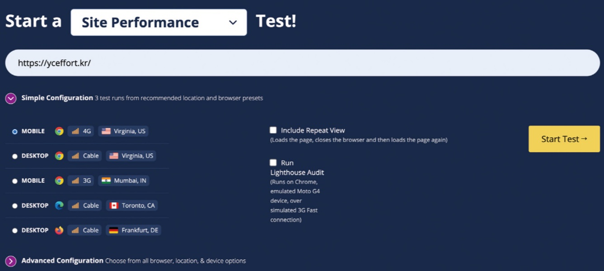</img><br/>
먼저 https://www.webpagetest.org/에 접속한 다음, Site Performance를 선택하고 분석하고 싶은 웹 사이트 주소를 입력한다.  
그 후 Start Test를 누르면 테스트가 시작된다.

### 13.3.1 Performance Summary
테스트가 완료되면 다음과 같이 전체적인 결과를 요약해서 볼 수 있다.
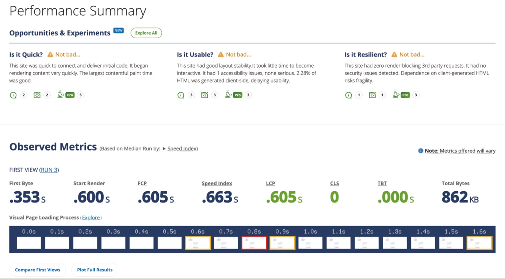</img><br/>

WebPageTest의 성능 테스트는 총 3번 이뤄지기 때문에 3개의 서로 다른 결과를 확인할 수 있다.
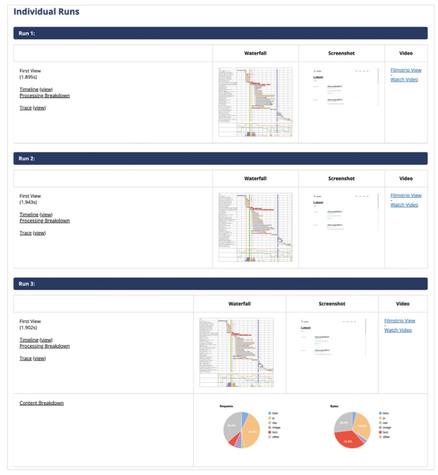</img><br/>

### 13.3.2 Opportunities & Experiments
Opportunities & Experiments에서는 웹 사이트에 대한 평가를 총 3가지(Is it Quick, Is it Usable, Is it Resilient)로 나눠서 보여주고, 각 항목에 대한 간단한 평가를 내린다.  
#### (1) Is it Quick 

    웹사이트가 충분히 빠른지를 평가한다. 여기서 빠름을 나타내는 것은 최초 바이트의 시간(TTFB)이 짧은지, 콘텐츠 렌더링이 즉각적으로 일어나는지, 최대 콘텐츠풀 페인트(LCP) 시간이 합리적인지를 확인한다.

- 자바스크립트가 적으면 적을수록 렌더링하는 데 수월해진다.
- 최초로 응답하는 바이트가 빠르면 빠를수록 렌더링을 빠르게 하는 데 도움이 된다.
- 사용자가 콘텐츠를 볼 수 있는 시점은 빠를수록 좋다.만약 최초 콘텐츠풀 페인트가 느리다면 어떤 리소스를 어떻게 개선하면 좋을지 알려준다.
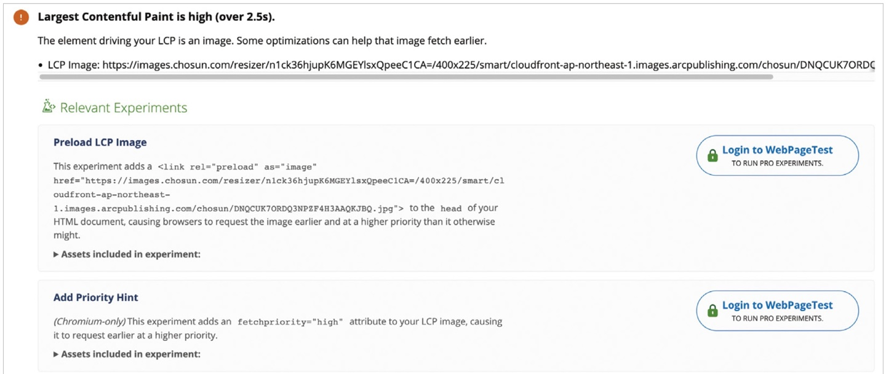</img><br/>

- 최초로 다운로드 받은 HTML과 최종 결과물 HTML 사이에 크기 차이가 적어야 한다. 
</img><br/>
최종 HTML의 95.54%가 새롭게 만들어진 것을 알 수 있다. 이는 애플리케이션의 규모가 커질수록 더욱 심각한 문제가 될 것이다.


#### (2) Is it Usable

    웹사이트의 사용성과 시각적인 요소를 확인한다. 

* 이미지의 비율이 없을 경우 이미지 크기를 알 수 없어 레이아웃 이동이 발생하게 되므로 이미지가 있다면 미리 적당한 width와 height를 지정하는 것이 좋다.
* 메인 스레드가 장시간 멈춰 있어서는 안된다. 가능한 한 실행되는 자바스크립트의 크기를 줄이는 것이 좋다.
* meta: viewpoint가 적절하게 삽입돼 있어야 한다. meta:viewport는 사용자가 볼 수 있는 영역인 뷰포트를 제어하는 속성이다. 이는 사용자가 접속한 디바이스에 따라 달라지는데, 브라우저에 해당 페이지의 면적 및 비율을 어떻게 제어할지를 정의한다.
```
<meta name ="viewport" content="width=device-width, initial-scale=" />
```
#### (3) Is it Resilient

    보안 취약성을 점검한다.

* 렌더링을 막는 제3자 라이브러리 요청이 없어야 한다. 기본적으로, 외부에서 불러오는 자바스크립트와 CSS 등의 리소스는 페이지의 렌더링을 막는다.
* Snyk에서 검출된 보안 위협이 없어야 한다.
* 모든 요청은 HTTP가 아닌 HTTPS를 거쳐야 한다.

### 13.3.3 Filmstrip
#### Filmstrip이란?
: 웹 사이트를 시간의 흐름에 따라 어떻게 웹사이트가 그려졌는지, 또 이때 어떤 리소스가 불러와졌는지 볼 수 있는 메뉴  

💡 Filmstrip 메뉴를 활용하면 렌더링을 가로막는 리소스나 예상보다 일찍 진행되는 스크립트 등을 확인할 수 있다.
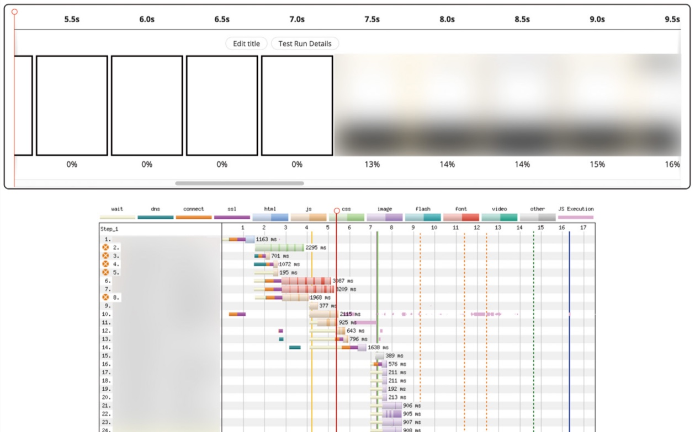</img><br/>
이 그림은 실제 서비스 중인 웹사이트를 WePageTest를 통해 분석한 결과로, 여기에 나타난 지표만으로 여러 가지 문제점과 개선 방안을 파악할 수 있다.

* 그림의 아래쪽 창 왼쪽에 주황색 X 표시가 있는 것은 렌더링을 블로킹하는 리소스라는 뜻이다. 실제 웹사이트를 가보면 동기식으로 보내는 스크립트가 존재하는 것을 확인할 수 있다.  
* 가운데 녹색 세로선은 최초 콘텐츠풀 페인트를 의미하는데, 11번 리소스의 실행이 다 끝난 후에 비로소 유의미한 렌더링이 시작됐음을 알 수 있다.
* 이런 점을 미루어 보아 이 웹사이트는 싱글 페이지 애플리케이션으로 추측할 수 있는데, 서버 사이드 렌더링을 수행하면 유의미한 성능 향상을 누릴 수 있을 것이다.

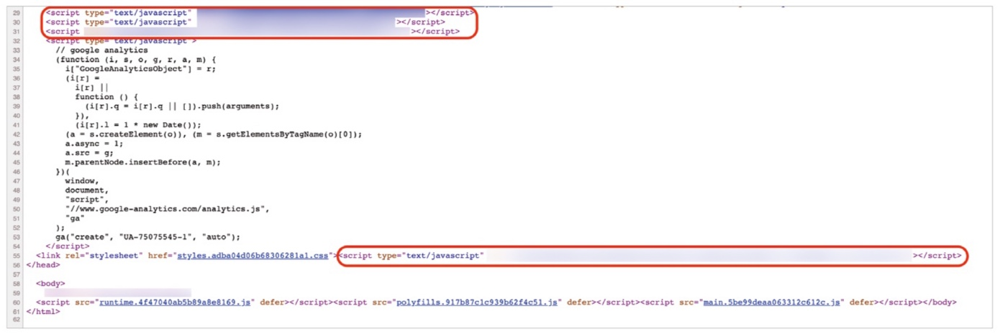</img><br/>

* Filmstrip으로 성능 측정한 웹사이트를 소스 보기로 확인한 모습으로, 스크립트의 순서를 body 이후로 내리면 조금 더 성능이 향상될 것이다.

이처럼 Filmstrip의 그래프를 직접 확인하면 어떠한 것이 성능에 영향을 미치는지, 개선점은 무엇이 있는지 확인할 수 있으며 이 외에도 다양한 성능 관련 수치를 그래프로 확인할 수 있다.  

### 13.3.4 Details
이 메뉴에서는 각 요청에 대한 상세한 설명과 Filmstrip 메뉴에서 제대로 설명해 주지 않았던 각종 실선과 그림과 관련된 설명이 덧붙여져 있어서 Filmstrip에서 재대로 이해하지 못한 내용이 있다면 여기서 확인하면 좋다.

### 13.3.5 Web Vitals
최대 콘텐츠풀 페인트(LCP), 누적 레이아웃 이동(CLS), 총 블로킹 시간(TBT)에 대한 자세한 내용을 확인할 수 있다. 

### 13.3.6 Optimizations
최적화와 관련된 메뉴로, 리소스들이 얼마나 최적화돼 있는지 나타난다.

### 13.3.7 Content
이 메뉴에서는 웹사이트에서 제공하는 콘텐츠, 애셋을 종류별로 묶어 통게를 보여준다.  
애셋 종류별 크기와 로딩 과정을 확인할 수 있으며, 시간의 흐름에 따라 렌더링을 거치면서 또 어떻게 애셋을 불러오는지도 확인할 수 있다.

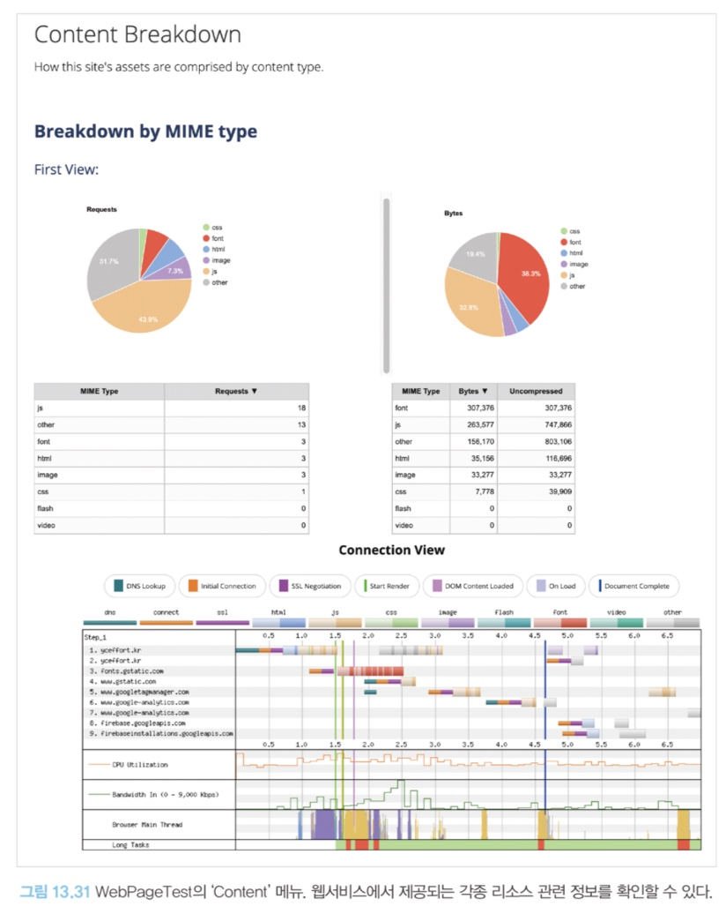</img><br/>

### 13.3.8 Domains
이 메뉴에서는 Content 메뉴에서 보여준 애셋들이 어느 도메인에 왔는지를 도메인별로 묶어서 확인할 수 있다.  
또한 해당 도메인별로 요청한 크기는 어느 정도인지 확인할 수도 있다.

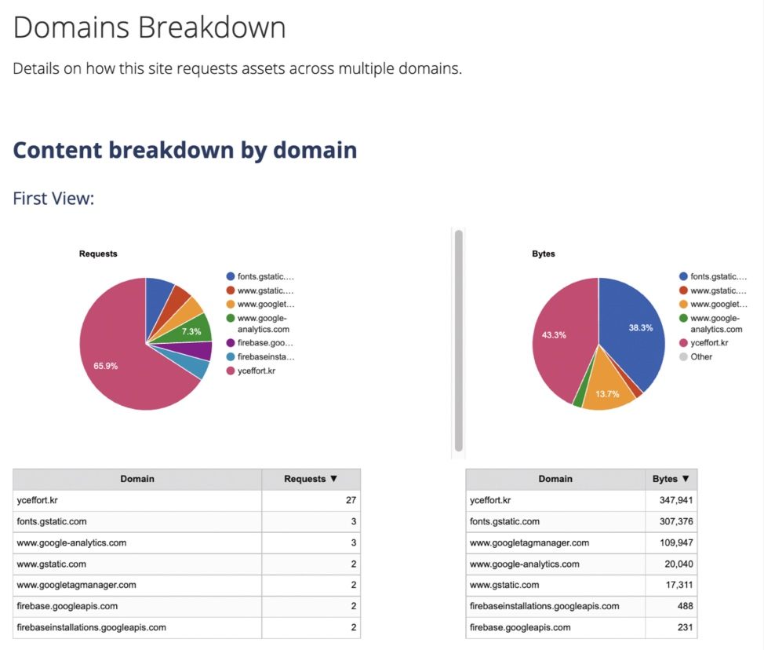</img><br/>

### 13.3.9 Console Log
사용자가 웹페이지에 접속했을 때 console.log로 무엇이 기록됐는지 확인할 수 있다.  
💡console.log 자체가 부하가 발생하기 때문에 가급적 기록하는 일은 없어야 한다. 하지만, 만약 디버깅 목적으로 사용하고 있다면 환경변수 등의 방법을 사용해 개발자만 제한적으로 볼 수 있게 해야 한다. 

### 13.3.10 Detected Technologies
웹사이트를 개발하는 데 사용된 기술을 확인할 수 있는 메뉴다. 평소에 관심이 있거나 신기한 웹사이트가 있었다면 이 메뉴를 활용해 어떻게 만들었는지 짐작해 볼 수 있다.
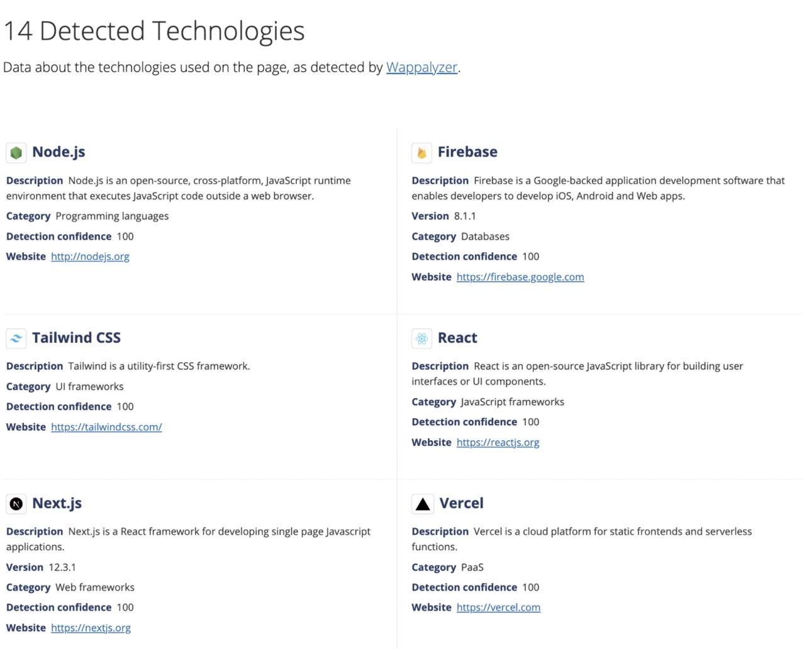</img><br/>

### 13.3.11 Main-thread Processing
#### Processing Breakdown
* 이 메뉴의 하위 항목으로 여기서 메인 스레드가 어떤 작업을 처리했는지 확인할 수 있다.  
* 메인 스레드의 작업을 크게 실행, 레이아웃, 리소스로딩, 페인팅, 기타의 총 다섯 가지로 분류해서 알려준다.
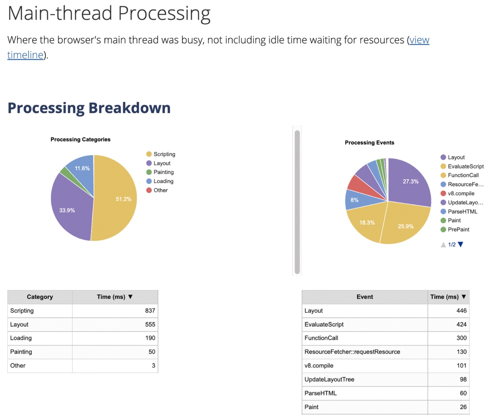</img><br/>

#### Time Breakdown
* 여기서 유휴 시간을 포함해 메인 스레드의 작업을 확인할 수 있다.
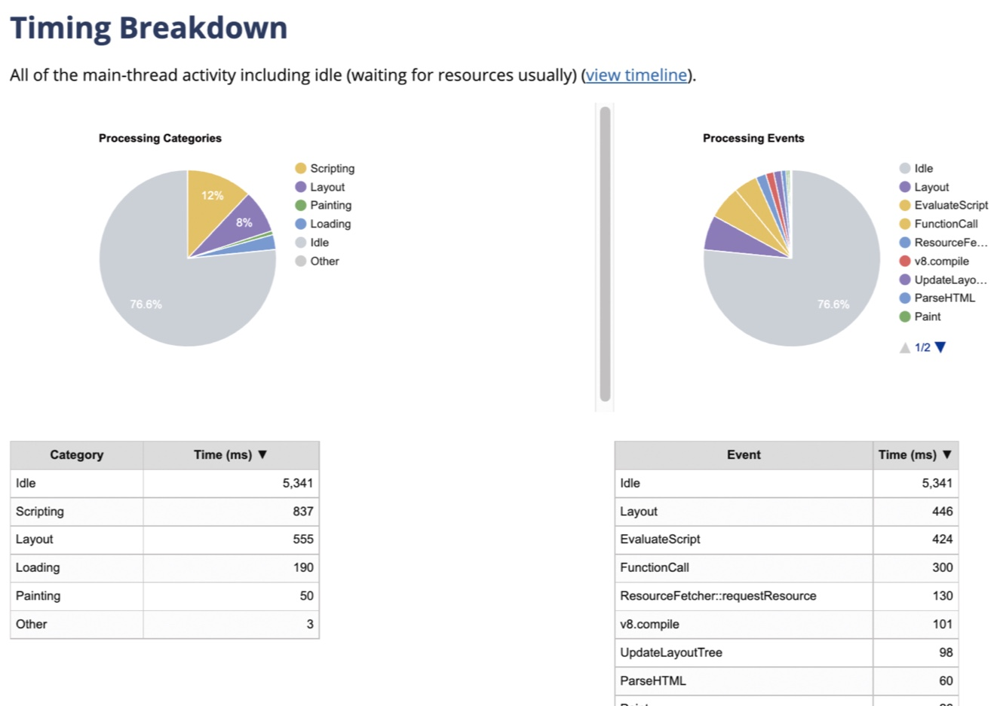</img><br/>

### 13.3.12 Lighthouse Report
구글 라이트하우스 리포트를 확인할 수 있다. 

### 13.3.13 기타
이 외의 메뉴는 WebPageTest 외부에서 제공하는 서비스로, 링크를 클릭하면 모두 외부 페이지로 이동한다.

    - Image Analysis : 해당 웹사이트에 어떠한 이미지가 있는지, 그리고 이 이미지들이 최적화되면 리소스를 어느 정도 아낄 수 있는지 보여준다.
    - Request Map : 췝사이트에서 요청이 어떻게 일어나고 있는지를 시각화 도구로 보여준다.
    - Data Cost : 각 국가별로 가장 저렴한 요금제를 기준으로 이 웹사이트를 로딩했을 때 실제로 얼마나 가격이 드는지 확인할 수 있는 웹사이트다. 
    - Security Score : 해당 사이트의 보안 취약점에 대해 알려준다.

## 13.4 크롬 개발자 도구
### 13.4.1 성능 통계
웹사이트의 성능을 자세하게 확인할 수 있는 도구로, 라이트하우스와 비슷하게 Page Load를 선택해 웹사이트 로딩 시작부터 끝까지를 확인하거나, 혹은 Start Recording을 눌러서 원하는 액션을 수행하면서 웹사이트 성능을 측정할 수 있다.

### 13.4,2 성능
성능 분석에 사용하기 위해 만들어진 탭이다. 자세한 정보를 조금 더 세밀하게 확인해볼 수 있다는 장점이 있다. 다만 일반적인 성능 분석과 측정은 Performance Insights 탭의 정보만으로도 충분하므로 더 자세하게 알고 싶은 경우에 참고하면 좋다.

## 13.5
성능을 개선하고 애플리케이션에서 병목 지점을 찾는 것은 개발하는 것 이상으로 어려운 일이다.  

    ⭐️ 성능을 0.1 초 개선한 것 만으로도 사용자에게는 긍정적인 사용자 경험을 안겨줄 수 있다는 사실을 상기하면서 스스로 개발한 웹사이트에 좀 더 큰 책임감을 가지고 연구해 보면 좋겠다.  
    ⭐️ 웹 사이트 성능 개선과 관련해서 지켜야 할 철칙을 잘 준수한다면 단순히 리액트 개발자가 아닌 웹 애플리케이션 개발자로 한 단계 더 성장할 것이다.

