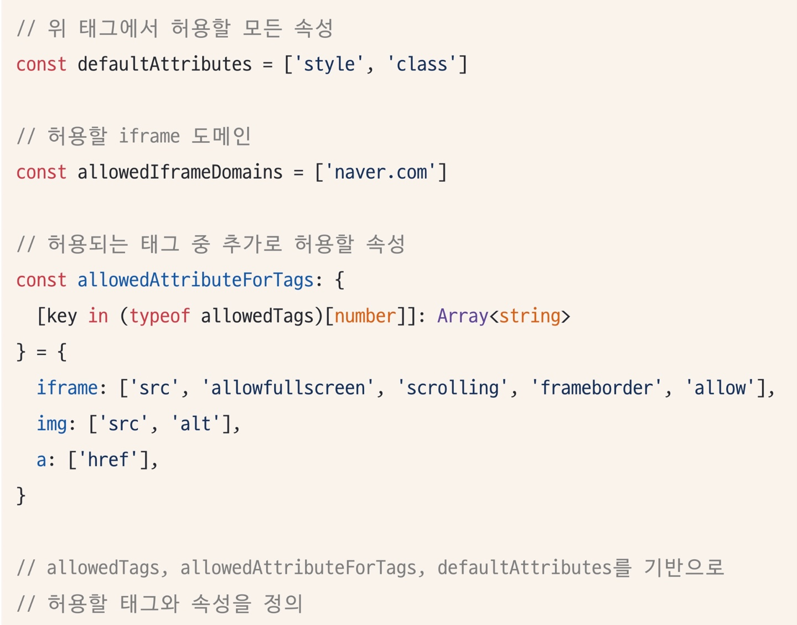
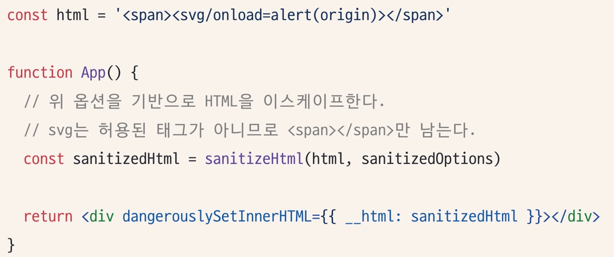
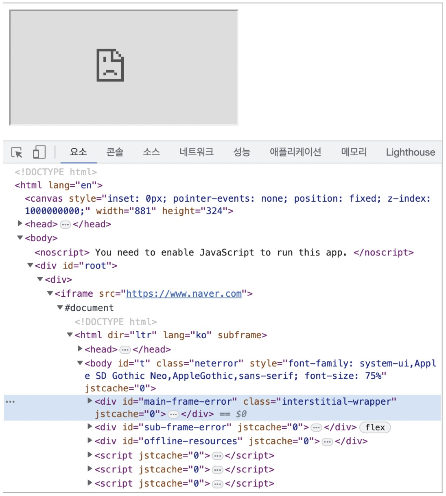
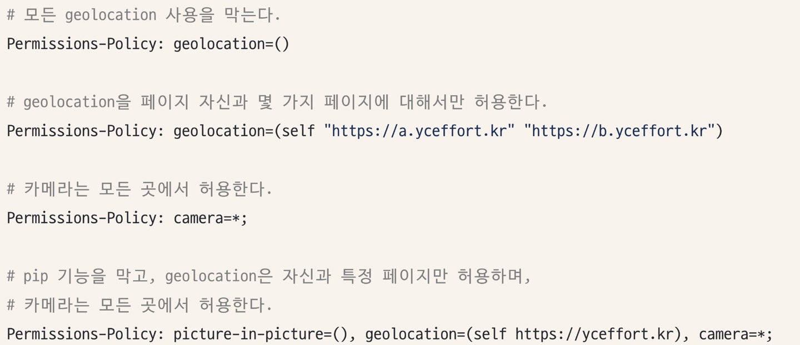
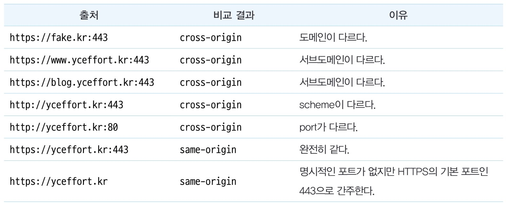
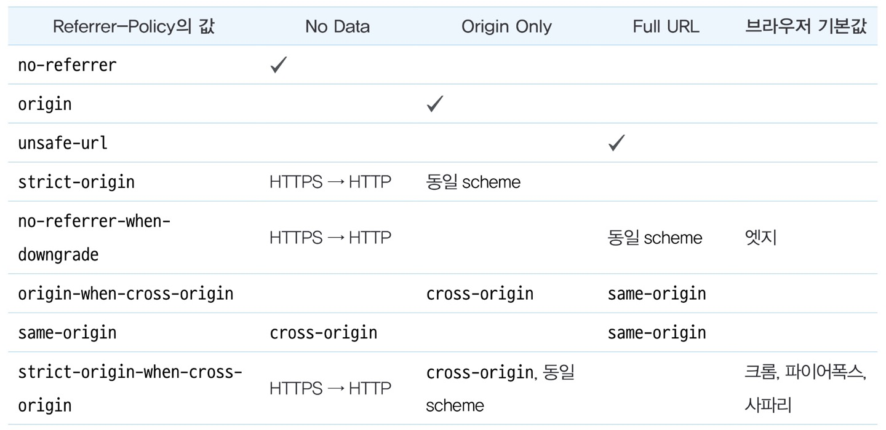
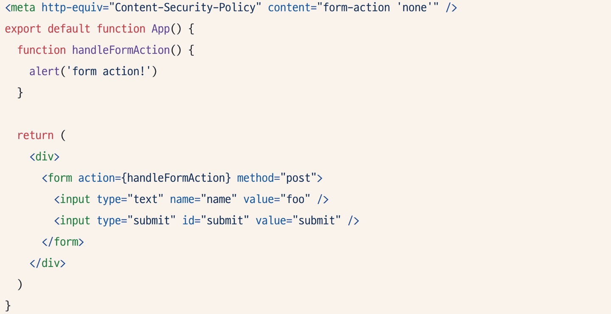

# 14장|웹사이트 보안을 위한 리액트와 웹페이지 보안 이슈
## 14.1 리액트에서 발생하는 크로스 사이트 스크립팅(XSS)
▪ 크로스 사이트 스크립팅 : 웹사이트 개발자가 아닌 제3자가 웹사이트에 악성 스크립트를 삽입해 실행할 수 있는 취약점
### 14.1.1 dangerouslySetInnerHTML prop
* 특정 브라우저 DOM의 innerHTML을 특정한 내용으로 교체할 수 있는 방법  
* 오직 __html 키를 가지고 있는 객체만 인수로 받을 수 있으며, 이 인수로 넘겨받은 문자열을 DOM에 그대로 표시하는 역할을 한다.  

💢 인수로 받는 문자열에는 제한이 없기 때문에 사용시 주의를 기울여야 하는 prop이며, 여기에 넘겨주는 문자열 값은 한 번 더 검증이 필요하다.

### 14.1.2 useRef를 활용한 직접 삽입
* useRef를 활용하면 직접 DOM에 접근할 수 있으므로 이 DOM에 앞서와 비슷한 방식으로 innerHTML에 보한 취약점이 있는 스크립트를 삽입하면 동일한 문제가 발생한다.

### 14.1.3 리액트에서 XSS 문제를 피하는 방법
_새니타이즈/이스케이프 : 리액트에서 XSS 이슈를 피하는 가장 확실한 방법은 제3자가 삽입할 수 있는 HTML을 환전한 HTML 코드로 한 번 치환하는 것_

* sanitize-html은 허용할 태그와 목록을 일일이 나열하는 **허용 목록(allow list)** 방식을 채택하기 때문에 안전하다.  <br/>
</img><br/>
</img><br/>  <br/>

* 단순히 보여줄 때뿐만 아니라 사용자가 콘텐츠를 저장할 때도 이스케이프 과정을 한 번 거치는 것이 더 효율적이고 안전하다.

💢 개발자는 자신이 작성한 코드가 아닌 외부에 존재하는 모든 코드를 위험한 코드로 간주하고 이를 적절하게 처리하는 것이 좋다.

## 14.2 getServerSideProps와 서버 컴포넌트를 주의하자
서버에는 일반 사용자에게 노출되면 안 되는 정보들이 담겨 있기 때문에 클라이언트, 즉 브라우저에 정보를 내려줄 때는 조심해야 한다.
* getServerSideProps가 반환하는 props 값은 모두 사용자의 HTML에 기록되고, 또한 전역 변수로 등록되어 스크립트로 충분히 접근할 수 있는 보안 위협에 노출되는 값이 된다.
* 따라서 getServerSideProps가 반환하는 값 또는 서버 컴포넌트가 클라이언트 컴포넌트에 반환하는 props는 반드시 필요한 값으로만 철저하게 제한되어야 한다.

## 14.3 ```<a>``` 태그의 값에 적절한 제한을 둬야 한다
```<a>``` 태그의 href에 javascript:로 시작하는 코드를 넣어둔 경우

▶️ ```<a>``` href로 선언된 URL로 페이지를 이동하는 것을 막고 onClick 이벤트와 같이 별도 이벤트 핸들러만 작동시키기 위한 용도로 주요 사용된다.  
```java
function App() {
    function handleClick() {
        console.log('hello')
    }

    return (
        <>
            <a href="javascript:;" onClick={handleClick}>
                링크
            </a>
        </>
    )
}
```
▶️ 이렇게 하면 ```<a>```의 href가 작동하지 않아 페이지 이동이 일어나지 않는 대신 onClick의 핸들러만 실행되는 것을 볼 수 있다.  

💢 그러나 ```<a>``` 태그는 반드시 페이지 이동이 있을 때만 사용하는 것이 좋으며, 페이지 이동 없이 어떠한 핸들러만 작동시키고 싶다면 ```<a>```보다는 button을 사용하는 것이 좋다.

## 14.4 HTTP 보안 헤더 설정하기
__HTTP 보안 헤더__ : 브라우저가 렌더링하는 내용과 관련된 보안 취약점을 미연에 방지하기 위해 브라우저와 함께 작동하는 헤더  

HTTP 보안 헤더만 효율적으로 사용할 수 있어도 많은 보안 취약점을 방지할 수 있다.  

### 14.4.1 Strict-Transport-Security
__HTTP의 Strict-Transport-Security 응답 헤더__ : 모든 사이트가 HTTPS를 통해 접근해야 하며, 만약 HTTP로 접근하는 경우 이러한 모든 시도는 HTTPS로 변경되게 한다.  

    사용법은 다음과 같다:
    Strinct-Transport-Security: max-age=<expire-time>; includeSubDomains 
* ```<expire-time>```은 이 설정을 브라우저가 기억해야 하는 시간을 의미하며, 초 단위로 기록된다. 
* 이 기간 내에는 HTTP로 사용자가 요청한다 하더라도 브라우저는 이 시간을 기억하고 있다가 자동으로 HTTPS로 요청하게 된다.

### 14.4.2 X-XSS-Protection
__X-XSS-Protection__ : 페이지에서 XSS 취약점이 발견되면 페이지 로딩을 중단하는 헤더  
```
X-XSS-Protection: 0
X-XSS-Protection: 1
X-XSS-Protection: 1; mode=block
X-XSS-Protection: 1; report=<reporting-uri>
```
* 0 : XSS 필터링을 끈다.
* 1 : 기본값으로, XSS 필터링을 켜게 된다. 만약 XSS 공격이 페이지 내부에서 감지되면 XSS 관련 코드를 제거한 안전한 페이지를 보여준다. 
* 1; mode=block : 1과 유사하지만 코드를 제거하는 것이 아니라 아예 접근 자체를 막아버린다.
* 1; report=<reporting-uri>는 크로미움 기반 브로우저에서만 작동하며, XSS 공격이 감지되면 보고서를 report= 쪽으로 보낸다.  

### 14.4.3 X-Frame-Options
__X-Frame-Oprions__ 는 페이지를 frame, iframe, embed, object 내부에서렌더링을 허용할지를 나타낼 수 있다.  

    (ex) 네이버와 비슷한 주소를 가진 페이지가 있고, 공격자는 이 페이지에서 네이버를 iframe으로 렌더링하여 사용자의 개인정보를 탈취하려 하는 경우
    ▶️ X-Frame-Oprtions는 외부에서 자신의 페이지를 위와 같은 방식으로 삽입되는 것을 막아주는 헤더다.

아래 코드와 같이 네이버와 관계없는 제3의 페이지에서 ```<iframe>```으로 네이버 페이지를 삽입해서 실행하면 네이버 페이지가 정상적으로 노출되지 않음을 볼 수 있다.

```
export default function App() {
    return (
        <div className="App">
            <iframe src="https://www.naver.com" />
        </div>
    )
}
```
</img>  
이는 네이버에 X-Frame-Options: deny 옵션이 있기 때문이다. 이 옵션은 제 3의 페이지에서 ```<iframe>```으로 삽입되는 것을 막아준다.

네이버의 응답 헤더를 보면 해당 옵션이 활성화된 것을 알 수 있다.
```
X-Frame-Options: DENY
X-Frame-Options: SAMEORIGIN
```
* DENY:만약 위와 같은 프레임 관련 코드가 있다면 무조건 막는다.
* SAMEORIGIN:같은 origin에 대해서만 프레임을 허용한다.

### 14.4.4 Permissions-Policy
__Permissions-Policy__ : 웹사이트에서 사용할 수 있는 기능과 사용할 수 없는 기능을 명시적으로 선언하는 헤더  
▶️  여기서 말하는 기능이란 카메라나 GPS와 같이 브라우저가 제공하는 기능을 말한다.

    (ex) 브라우저에서 사용자의 위치를 확인하는 기능과 관련된 코드를 전혀 작성하지 않은 경우
    💢 해당 기능이 별도로 차단돼 있지 않고, 그 와중에 XSS 공격 등으로 인해 이 기능을 취득해서 사용하게 되면 사용자의 위치를 획득할 수 있게 된다. 
    ▶️ Permissions-Policy 헤더를 활용해 XSS가 발생한다고 하더라도 사용자에게 미칠 수 있는 악영향을 제한할 수 있게 된다.

__XSS를 사용하는 예제 헤더__  
</img>

### 14.4.5 X-Content-Type-Options
MIME : 원래는 메일을 전송할 때 사용하던 인코딩 방식으로, 현재는 Content-type에서 대표적으로 사용되고 있다. 


    네이버에서는 www.naver.com을 Content-Type: text/html; charset=UTF-8로 반환해 브라우저가 이를 UTF-8로 인코딩된 text/html로 인식할 수 있게 도와주고, 브라우저는 이 헤더를 참고해 해당 파일에 대해 HTML을 파싱하는 과정을 거치게 된다.  

__X-Content-Type-Options__ : Content-type 헤더에서 제공하는 MIME 유형이 브라우저에 의해 임의로 변경되지 않게 하는 헤더

### 14.4.6 Referrer-Policy
__Referrer__
* 현재 요청을 보낸 페이지의 주소를 나타내는 헤더  
* 사용자가 어디서 와서 방문 중인지 인식 가능
* 반대로 사용자 입장에서는 원치 않는 정보가 노출될 위험도 존재  
➡️ Refferer-Policy 헤더는 이 헤더에서 사용할 수 있는 데이터를 나타낸다

__출처(origin)__  
먼저 <https://yceffort.kr>이라는 주소의 출처는 다음과 같이 구성돼 있다.
* scheme: HTTPS 프로토콜을 의미한다.
* hostname: yceffort.kr이라는 호스트명을 의미한다.
* port: 443 포트를 의미한다.

이 세 조합을 출처라고 한다. 그리고 두 주소를 비교할 때 same-origin인지, cross-origin인지는 다음과 같이 구분할 수 있다.  
</img>  
이러한 출처에 대한 정보를 바탕으로 Referrer-Policy의 각 값별로 다음과 같이 작동한다.  
</img>  
Referrer-Policy는 응답 헤더뿐만 아니라 페이지의 ```<meta/>``` 태그로도 다음과 같이 설정할 수 있다.
```html
<meta name="referrer" content="origin />
```

그리고 페이지 이동 시나 이미지 요청, link 태그 등에도 다음과 같이 사용할 수 있다.
```html
<a href="http://yceffort.kr" referrerpolicy="origin">...</a>
```

### 14.4.7 Contet-Security-Policy
콘텐츠 보안 정책(Content-Security-Policy, CSP)은 XSS 공격이나 데이터 삽입 공격과 같은 다양한 보안 위협을 막기 위해 설계됐다.  

#### *-src
다양한 src를 제어할 수 있는 지시문
```
Content-Security-Policy: font-src <source>;
Content-Security-Policy: font-src <source> <source>;
```
위와 같이 선언해 두면 font의 src로 가져올 수 있는 소스를 제한할 수 있다.

### form-action
form-action은 폼 양식으로 제출할 수 있는 URL을 제한할 수 있다. 다음과 같이 form-action 자체를 모두 막아버리는 것도 가능하다.
</img>

### 14.4.8 보안 헤더 설정하기
#### Next.js
Next.js에서는 애플리케이션 보안을 위해 HTTP 경로별로 보안 헤더를 적용할 수 있다. 이 설정은 next.config.js에서 추가할 수 있다.

#### NGINX
정적인 파일을 제공하는 NGINX의 경우 경로별로 add_header 지시자를 사용해 원하는 응답 헤더를 추가할 수 있다.

### 14.4.9 보안 헤더 확인하기
가장 빠른 방법은 보안 헤더의 현황을 알려주는 <https://securityheaders.com/>을 방문하는 것이다. 

## 14.5 취약점이 있는 패키지의 사용을 피하자
깃허브의 Dependabot이 발견한 취약점은 필요하다면 빠르게 업데이트해 조치해야 한다.   

그리고 리액트, Next.js 또는 사용 중인 상태 관리 라이브러리와 같이 프로젝트를 구성하는 핵심적인 패키지는 버저닝과 패치 수정 등은 항상 예의주시해야 한다.

## 14.6 OWASP Top 10
OWASP : 웹에서 발생할 수 있는 정보 노출, 악성 스크립트, 보안 취약점 등을 연구하며, 주기적으로 10대 웹 애플리케이션 취약점을 공개하는데 이를 OWASP Top 10이라고 한다.  

OWASP Top 10은 웹 애플리케이션에서 발생할 수 있는 주요 보안 취약점을 요약해 주는 것뿐만 아니라 이 문제를 어떻게 조치해야 하는지도 자세히 소개한다.
