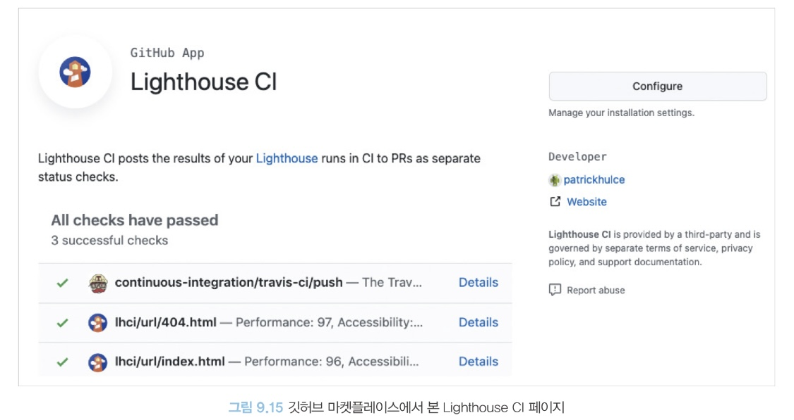

# 09장|모던 리액트 개발 도구로 개발 및 배포 환경 구축하기
## 9.1 Next.js로 리액트 개발 환경 구축하기
### 9.1.1 create-next-app 없이 하나씩 구축하기
### 9.1.2 tsconfig.json 작성하기
npm 설정을 package.json에서 하는 것처럼 타임스크립트 설정은 tsconfig.json에 기록한다.
* compilerOptions: 타입스크립트를 자바스크립트로 컴파일할 때 사용하는 옵션이다.
  * stictNullChecks: 엄격한 널 검사 활성화. 런타임 에러를 미연에 방지할 수 있어 꼭 켜두기를 권장
  * strictBindCallApply: call, bind, apply에 대해 정확한 인수를 요구하는 옵션. 꼭 켜두기를 권장
  * strictFunctionTypes: 함수의 타입에 대해 엄격함을 유지. 켜두는 것을 권장
### 9.1.3 next.config.js 작성하기
```java
/** @type {import('next').NextConfig} */
const nextConfig = {
    reactStrictMode: true,
    poweredByHeader: false,
    eslint: {
        ignoreDuringBuilds: true,
    },
}

module.exports = nextConfig
```
깃허브 저장소에서 본인이 사용 중인 버전의 태그를 들어가면 해당 버전에서 사용 가능한 옵션을 확인할 수 있다.

### 9.1.4 ESLint와 Prettier 설정하기
* 코드 스타일링 등 eslint-config-next가 해주지 않는 일반적인 ESLint 작업을 수행하기 위해 가장 설치 및 설정이 쉬운 @titicaca/eslint-config-triple을 설치해 사용한다.
* 유점해야 할 것은 eslint-config-next와 eslint-config-triple이 함께 작동하게 하려면 별도의 설정이 필요하다.

### 9.1.5 스타일 설정하기
1. Next.js에 스타일을 적용하기 위해 styled-components를 사용하고자 한다.
2. styledComponents: true를 next.config.js에 추가한다.
3. pages/_document.tsx의 Head에 styled-components를 사용하기 위한 ServerStyleSheet를 추가한다.

### 9.1.6 애플리케이션 코드 작성

### 9.1.7 정리
실무에서 사용할 프로젝트나 개인 프로젝트에서 사용할 프로젝트를 만들다 보면 팀의 컨벤셩이나 다양한 공통 라이브러리 설치 등의 이슈로 생각보다 프로젝트를 구축하는 것이 손이 많이 가는 일이라는 것을 깨닫게 될 것이다.  
프로젝트를 새로 만들 때마다 똑같은 설정을 매번 반복하는 것은 비효율적이기 때문에 다음과 같은 방법을 고려해 볼 수 있다.
1. 보일러플레이트 프로젝트를 만든 다음, 깃허브에서 Template repository 옵션을 체크해둔다. 이렇게 저장소를 템플릿 저장소로 만들어두면 다른 저장소를 생성할 때 이 내용을 모두 복사해서 생성할 수 있다.
2. create-next-app에서 한 발 더 나아가 나만의 create-***-app을 만드는 것이다.

## 9.2 깃허브 100% 활용하기
### 9.2.1 깃허브 액션으로 CI 환경 구축하기
CI : 코드의 변화를 모으고 관리하는 코드 중앙 저장소에서, 여러 기여자가 기여한 코드를 지속적으로 빌드하고 테스트해 코드의 정합성을 확인하는 과정  
CI의 핵심은 저장소에서 코드의 변화가 있을 때마다 전체 소프트웨어의 정합성을 확인하기 위해 테스트, 빌드, 정적 분석, 보안 취약점 분석 등의 작업을 해야 한다.  
* 젠킨스(Jenkins): CI 환경을 구축하기 위해 자주 쓰였던 솔루션으로, 편리하고 많은 플러그인을 통해 다양한 기능을 통합할 수 있지만 설치 및 유지보수가 번거롭다는 단점이 있다.
* 깃허브 액션: 깃허브를 둘러싼 다양한 이벤트를 기반으로 깃허브에서 제공하는 가상 환경을 사용자가 원하는 작업을 수행할 수 있도록 도와주는 서비스
이러한 작업에는 다음과 같은 것이 포함된다.
  * 깃허브의 어떤 브랜치에서 푸시가 발생하면 빌드를 수행한다.
  * 깃허브의 특정 브랜치가 메인 브래니를 대상으로 풀 리퀘스트가 열리면 빌드, 테스트, 정적 분석을 수행한다.

#### 깃허브 액션의 기본 개념
+ 러너(runner): 파일로 작성된 깃허브 액션이 실행되는 서버
+ 액션(action): 러너에서 실행되는 하나의 작업 단위로, yaml 파일로 작성된 내용을 하나의 액션으로 볼 수 있다.
+ 이벤트(event): 깃허브 액션의 실행을 일으키는 이벤트
  + pull_request: PR과 관련된 이벤트로서, PR이 열리거나, 닫히거나, 수정되는 등의 PR과 관련된 이벤트를 의미한다.
  + issues: 이슈와 관련된 이벤트
  + push: 커밋이나 태그가 푸시될 때 발생하는 이벤트
  + schedule: 저장소에서 발생하는 이벤트와 별개로 특정 시간에 실행되는 이벤트
+ 잡(jobs): 하나의 러너에서 실행되는 여러 스텝의 모음
+ 스텝: 잡 내부에서 일어나는 하나하나의 작업
요약하자면 스텝들을 엮어서 잡을 만들고, 잡을 모아둔 것을 액션이라고 하며, 액션을 실행하는 러너다.  

#### 깃허브 액션 작성하기
액션을 작성하려면 저장소의 루트에 .github/workflows 폴더를 생성하고 내부에 파일을 작성하면 된다.  
파일명을 마음대로 지정할 수 있고, 확장자는 .yml또는 .yaml로 지정해야 한다.
</img><br/>
예시로 작성한 액션은 Next.js 애플리케이션의 빌드를 확인하는 CI 액션이다.  
해당 파일을 ./github/workflows/build.yaml이라는 이름으로 저장한 다음, 별도 브랜치에서 푸시하고 풀 리퀘스트를 만들어 확인해 보면 다음과 같다.  
</img><br/>
그리고 Details를 누르면 해당 CI가 어떤 절차를 걸쳐 완료됐는지 확인할 수 있다.  
</img><br/>
Details에서는 해당 액션의 실행 결과를 자세히 확인할 수 있다. 
</img><br/>
액션을 실행한 지 일정 시간이 흐르면 더 이상 로그를 확인할 수 없게 된다.  

##### 액션이 yaml 파일 내에서 어떻게 작성됐고 각 값은 무엇일지 알아보자.  
* name: 액션의 이름. 액션을 구별하는 데 도움을 준다.
* run-name: 액션이 실행될 때 구별할 수 있는 타이틀명
* on: 필수 값으로, 언제 이 액션을 실행할지 정의한다. 예제에서는 원격 저장소의 푸시가 발생했을 때 실행하도록 했으며, main 브랜치에서 푸시가 발생했을 때는 실행하지 않도록 설정했다.
* jobs: 필수값으로, 해당 액션에서 수행할 잡을 의미한다. 한 개 이상 설정할 수 있으며, 여러 개를 지정하면 병렬로 실행된다.

###### 액션 작성
앞서와 같이 액션을 작성하면 Next.js 프로젝트를 빌드하는 CI를 작성할 수 있다.

###### 브랜치 보호 규칙
마지막으로 머지하기 전에 꼭 성공해야 하는 액션이 있다면 별도로 저장소에 브랜치 보호 규칙을 추가할 수 있다.  
해당 저장소의 Settings->Code and automation->Branches로 이동한 다음, Add branch protection rule을 클릭해 브랜치 보호 규칙을 추가하면 된다.  
</img><br/>
사진에서는 main 브랜치에 머지할 때는 build.yaml이 성공해야 머지할 수 있도록 설정했다.  
</img><br/>
브랜치 보호 규칙을 설정해 두면 build에 실패했을 때 머지할 수 없다.

### 9.2.2 직접 작성하지 않고 유용한 액션과 깃허브 앱 가져다 쓰기
깃허브 액션은 단순한 작업 외에 여러 가지 작업을 수행하기에는 여전히 복잡하고 어려울 수 있다.  
깃허브에서는 Marketplaces라는 서비스를 제공해 여러 사용자가 만들어 놓은 액션을 손쉽게 가져다 쓸 수 있도록 운영하고 있다.  

#### 깃허브에서 제공하는 기본 액션
* actions/checkout: 깃허브 저장소를 체크아웃하는 액션으로, 저장소를 기반으로 작업을 해야 한다면 반드시 필요하다.
* actions/setsup-node: Node.js를 설치하는 액션으로, Node.js를 사용하는 프로젝트라면 반드시 필요하다.
* actions/github-script: GitHub API가 제공하는 기능을 사용할 수 있도록 도와주는 액션
* actions/stale: 오래된 이슈나 PR을 자동으로 닫거나 더 이상 커뮤니케이션하지 못하도록 닫는다.
* actions/dependency-review-action: package.json 등의 내용이 변경됐을 때 실행되는 액션
* actions/codeql-action: 깃허브의 코드 분석 솔루션인 code-ql을 활용해 저장소 내 코드의 취약점을 분석해 준다.

#### cailbreapp/image-actions
PR로 올라온 이미지를 sharp 패키지를 이용해 거의 무손실로 압축해서 다시 커밋해 준다.  
</img><br/>
해당 액션은 이미지를 가져다가 새롭게 커밋해야 하므로 액션이 커밋을 할 수 있도록 권한을 줘야 한다.  
권한을 제공하려면 githubToken:${{ secrets.GITHUB_TOKEN }}을 추가하면 된다.  
ignorePaths에 파일을 기재하면 해당 파일에 대해서는 압축을 건너뛸 수도 있다.  
</img><br/>
image-actions로 이미지가 압축됐다는 깃허브 댓글을 확인할 수 있다.

#### lirantal/is-website-vulnerable
lirantal/is-website-vulnerable은 특정 웹사이트를 방문해 해당 웹사이트에 라이브러리 취약점이 존재하는지 확인하는 깃허브 액션이다.  
</img><br/>
넷플릭스 홈페이지 어디선가 Lodash 3.10.1 버전을 사용하고 있고, Snyk의 분석을 거쳐 취약점이 있는 패키지 버전으로 지목됐음을 알 수 있다.  

#### Lighthouse CI
Lighthouse CI: 웹 성능 지표인 라이트하우스를 CI를 기반으로 실행할 수 있도록 도와주는 도구  
이 액션을 사용하면 프로젝트의 URL을 방문해 라이트하우스 검사를 실행  
이를 통해 현재 머지 예정인 웹사이트의 성능 지표를 측정할 수 있다.  

##### ✏️ Lighthouse CI를 액션으로 사용하는 방법
1. Lighthouse CI 홈페이지를 방문해서 Configure를 누른 다음, 해당 깃허브 앱이 사용하고자 하는 저장소의 권한을 얻는다.
</img><br/>

2. 액션을 작성한다.
</img><br/>
</img><br/>  

* 저장소를 checkout한 후, Node.js를 설치하고, 설치 후 빌드를 한다.  
* 이후에 lhci를 설치해 실행한다. 이때 LHCI_GITHUB_APP_TOKEN이라는 환경변수에 LHCI_GITHUB_APP_TOKEN을 넣는다.  
3. lhci를 실행하는 데 필요한 설정 파일을 추가한다. 이 파일은 저장소 루트에 생성해야 한다.
</img><br/>

4. 작성한 액션이 어떻게 작동하는지 확인한다. 다음과 같이 깃허브 액션이 끝나자마자 PR의 마지막에 라이트하우스의 결과가 추가됐다.
</img><br/>

그리고 이 링크를 눌러서 확인하면 해당 라이트하우스 결과에 따른 지표 정보를 확인할 수 있다.  
</img><br/>

### 9.2.3 깃허브 Dependabot으로 보안 취약점 해결하기
#### package.json의 dependencies 이해하기
##### 버전
유의적 버전의 정의
1. 기존 버전과 호환되지 않게 API가 바뀌면 "주 버전"을 올리고,
2. 기존 버전과 호환되면서 새로운 기능을 추가할 때는 "부 버전"을 올리고,
3. 기존 버전과 호환되면서 버그를 수정한 것이라면 "수 버전"을 올린다.
##### 의존성
package.json에서 dependencies란 npm 프로젝트를 운영하는 데 필요한 자신 외의 npm 라이브러리를 정의해 둔 목록이다.  
* dependencies: package.json에서 npm install을 실행하면 설치되는 의존성이며, npm install 패키지명을 실행하면 dependencies에 추가된다.
* devDependencies: package.json에서 npm install을 실행하면 설치되는 의존성이며, npm install 패키지명 --save-dev를 실행하면 devDependencies에 추가된다.
* peerDependencies는 주로 서비스보다는 라이브러리와 패키지에서 자주 쓰이는 단위다.

#### Dependabot으로 취약점 해결하기
대부분의 의존성은 package.json보다는 package-lock.json에 숨어 있는 경우가 많다.  
npm ls는 'list installed packages'라는 뜻으로 설치된 패키지가 왜 어떤 의존성 때문에 설치됐는지 확인할 수 있는 명령어다.  

##### 취약점 해결하기
1. 깃허브 Dependabot이 풀 리퀘스트를 열어준 경우
가장 쉽게 해결할 수 있는 경우이다.  
변경 사항을 가장 쉽게 확인해 볼 수 있는 것은 깃허브 저장소에 있는 릴리스 노트다.  
2. 풀리퀘스트로 해결할 수 있는 경우
패키지 내부에 선언된 의존성을 강제로 올릴 수 있는 방법은 npm이 제공하는 overrides를 활용하는 것이다.  
```java
{
  "overrides": {
    "minimatch": "^3.0.5"
  }
}
```

## 9.3 리액트 애플리케이션 배포하기
### 9.3.1 Netlify
웹 애플리케이션을 배포할 수 있도록 도와주는 클라우드 컴퓨팅 서비스  
역사가 오래된 만큼 많은 개발자들에게 사랑받고 있으며, 무료로도 어느 정도 활용이 가능해 크게 공을 들이지 않고 손쉽고 빠르게 웹 애플리케이션을 배포할 수 있다.  
### 9.3.2 Vercel
Next.js를 등에 업고 많은 사용자를 모으고 있다.
### 9.3.3 DigitalOcean
다른 업체와 다르게 GitHub Student Pack에 포함되어 있는데, 학생 계정으로 가입한 깃허브에 200달러 상당의 무료 크레딧을 제공한다.  

## 9.4 리액트 애플리케이션 도커라이즈하기
### 9.4.1 리액트 앱을 도커라이즈하는 방법
#### 도커란?
도커는 개발자가 모던 애플리케이션을 구축, 공유, 실행하는 것을 도와줄 수 있도록 설계된 플랫폼이다. 도커는 지루한 설정 과정을 대신해 주므로 코드를 작성하는 일에만 집중할 수 있다.  
도커는 애플리케이션을 빠르게 배포할 수 있도록 애플리케이션을 '컨테이너'라는 단위로 패키징하고, 이 '컨테이너' 내부에서 애플리케이션이 실행될 수 있도록 도와준다.
#### create-react-app을 위한 Dockerfile 작성하기
1. 운영체제 설정
2. Node.js 설치
3. npm ci
4. npm run build
5. 실행

### 9.4.2 도커로 만든 이미지 배포하기
1. 도커 이미지 업로드하기
2. 도커 이미지 실행하기