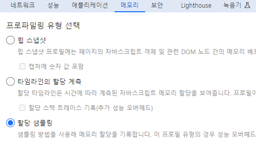

# 07. 크롬 개발자 도구를 활용한 애플리케이션 분석
## 메모리 탭
- 메모리 탭에서는 현재 웹페이지가 차지하고 있는 메모리 관련 정보를 확인 가능
- 애플리케이션에서 발생하는 메모리 누수, 속도 저하, 웹페이지 프리징 현상을 확인할 수 있는 유용한 도구

[종류]
- 힙 스냅샷 : 현재 페이지의 메모리 상태
    - 메모리 누수가 발생되는 부분이 예측이 될 때
- 타임라인 할당 계측 : 시간의 흐름에 따라 메모리 변화 확인
    - 메모리 변화를 일으킨 원인이 무엇인지 찾고 싶을 때
- 할당 샘플링 : 시간의 흐름에 따라 발생하는 메무리 점유 확인, 자바스크립트 실행 스택별로 분석, 분석을 함수 단위로 한다
    - 책의 예시에서는, 버튼 클릭 시 메모리 할당이 엄청나게 커짐을 확인할 수 있음