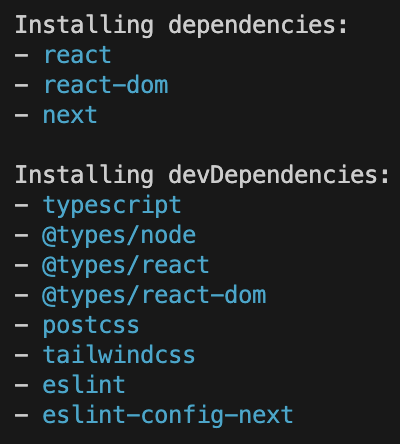
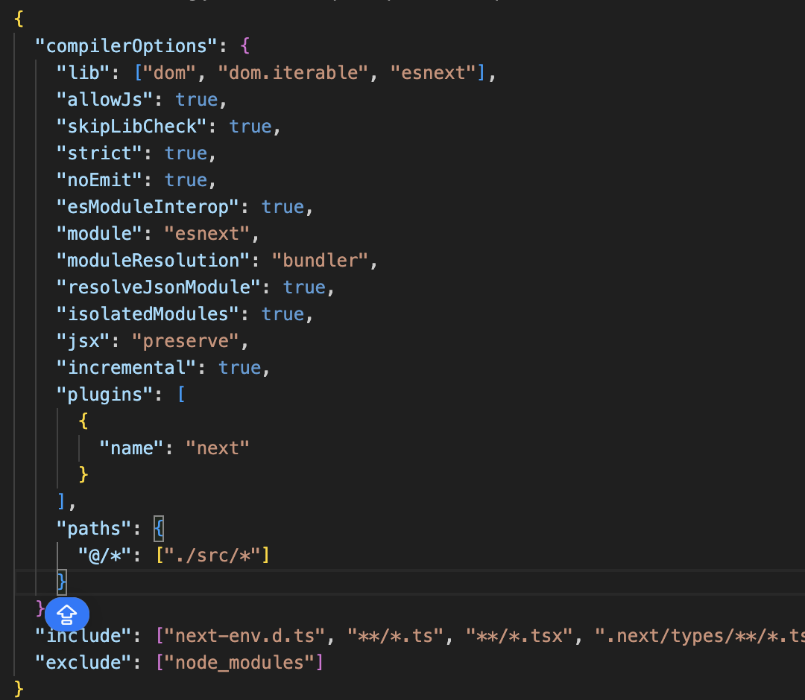

# 9. 모던 리액트 개발 도구로 개발 및 배포 환경 구축하기
## 9.1 Next.js로 리액트 개발 환경 구축하기
`create-react-app`, `create-next-app` : Next.js 애플리케이션을 손쉽게 만들기 위한 CLI 도구

이들이 초기 파일 세팅을 대신헤주기 때문에 프로젝트 구조를 공부하기에는 이 방법이 좋지 않다.

또한, 래액트 팀은 앞으로 `create-react-app` 은 리액트 애플리케이션을 만드는 보일러플레이트 CLI가 아니라 리액트 기반 프레임워크를 제안하는 런처 형태로 변경될 것이라고 밝힘! -> **리액트 프레임워크를 구축하는 방법을 공부할 필요가 있다.**

### 1) create-react-app 없이 하나씩 구축하기
1. package.json 만들기 => `npm init` 으로 생성
2. **Next를 실행하는 데 필요한 핵심 라이브러리 설치** : react, react-dom, next 설치 (npm i ~~) 
3. **devDependencies에 필요한 패키지 설치** : typescript, @types/react, @types/react-dom, @types/node, eslint, eslint-config-next


### 2) tsconfig.json 작성하기
- 타입스크립트 설정은 tsconfig.json에 기록한다.
```
{
    "$schema" : "https://json.schemastore.org/tsconfig.json"
}
// 1. JSON 최상단에 $schema 키값 넣기
// schema : JSON 파일이 무엇을 의미하는지, 어떤 키와 어떤 값이 들어갈 수 있는지 알려주는 도구 (JSON 입력 시, 자동완성 도와줌)
```

[create-next-app 했을 때 기본적으로 설치된 tsconfig.json 구조]

1. compilerOptions : 타입스크립트를 자바스크립트로 컴파일 할 때 사용하는 옵션
    
    `lib` 
    - esnext : 언어가 낮은 버전이라 하더라도, 신규 기능에 대한 API 정보를 확인할 수 있게 해준다
    - dom : 타입스크립트 환경에서 window, document 등 브라우저 위주의 API 명세를 사용할 수 있게 해준다

    `allowJS` : 타입스크립트가 자바스크립트 파일 또한 컴파일할지를 결정, .ts와 .js가 혼재되어 있을 때 유용
     
    `skipLibCheck` : 라이브러리에서 제공하는 d.ts에 대한 검사 여부 결정

    `strict` : 타입스크립트 컴파일러의 엄격모드 제어 (지금 당장 문제가 없어 보이더라도 이후에 있을 런타임 에러를 미연에 방지할 수 있음)
    - null, undefined 엄격히 구분
    - 함수의 인수 정확히 요구
    - 함수의 타입에 대해 엄격함 유지
    - 대소문자 구분

    `noEmit` : 컴파일을 하지 않고, 타입 체크만

    `module` : commonjs, esnext 가 있다. 
    - commonjs : require을 사용하고,
    - esnext : import를 사용한다. (import를 사용하는 환경에서는 esnext를 사용하는 것 권장)

    `jsx` : .tsx 파일 내부에 있는 JSX를 어떻게 컴파일할지 설정
    - preserve : 변환하지 않고 그대로 유지
    swc가 JSX 또한 변환해 주기 때문에

    `baseURL` : 프로젝트 폴더 내에 존재하는 파일들의 경로를 더욱 간편하게 하기 위해 공통된 경로를 미리 지정해주기

    `include` : 타입스크립트 컴파일 대상에서 포함시킬 파일 목록

    `exclude` : 타입스크립트 컴파일 대상에서 제외시킬 파일 목록

### 3) next.config.js 작성하기
- reactStrictMode : 리액트의 엄격 모드(콘솔에서 2번 찍히는것)
- poweredByHeader : 보안 취약점으로 취급되는 X-Powered-By 헤더 제거
- eslint : 빌드 시에 ESLint를 무시하도록

### 4) ESLint와 Prettier 설정하기
- eslint-config-next : 단순히 코드에 있을 잠재적인 문제를 확인할 뿐, 띄어쓰기나 줄바꿈과 같이 코드의 스타일링을 정의해 주지는 않는다.
- @titicaca/eslint-config-triple을 설치해 사용 <- 코드의 스타일링

### 5) 스타일 설정하기
교재에는 styled-components를 설명했지만,, 제가 알기로는 tailwind가 Next.js에 더 최적화된 스타일링 방법이라고 합니다 !!
실제로 create-next-app 하면 tailwind도 기본설정할 것인지 물어봄


### 6) 애플리케이션 코드 작성
애플리케이션 구동에 필요한 파일은 src 폴더 내부에 있으며, 하위 폴더 목록은 다음과 같다.
- pages : next.js의 예약어, pages 폴더의 하위 내용은 실제 라우터가 된다.
- components : 페이지 내부에서 사용하는 컴포넌트들을 모아둔 폴더
- hooks : 직접 만든 훅을 모아둔 폴더
- types : 서버 응답 타입 등 공통을 사용하는 타입을 모아둔 폴더
- utils : 애플리케이션 전역에서 공용으로 사용하는 유틸성 파일을 모아둔 폴더

pages를 제외하고는 개발자의 가독성인 있는 폴더 구조를 직접 커스터마이징 할 수 있다.

본인만의 Next 폴더 구조를 만들었다면, 깃헙에서 `Template repository` 옵션을 체크해두면, 나중에 다른 저장소를 생성할 때 해당 내용을 모두 복사해서 생성할 수 있다!(매번 초기 세팅을 해야 하는 번거로움을 덜어준다)