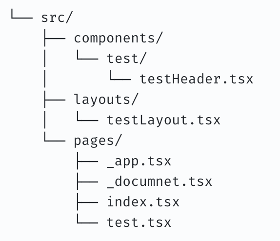
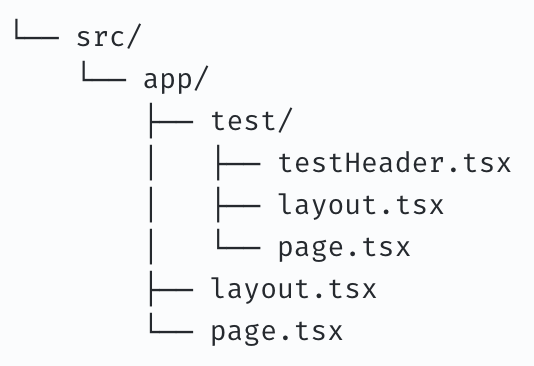
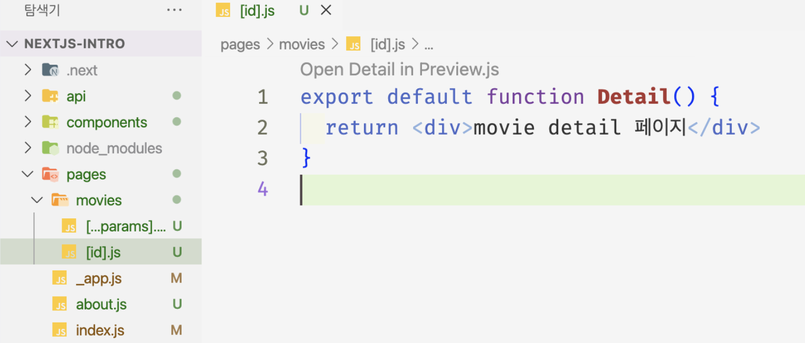
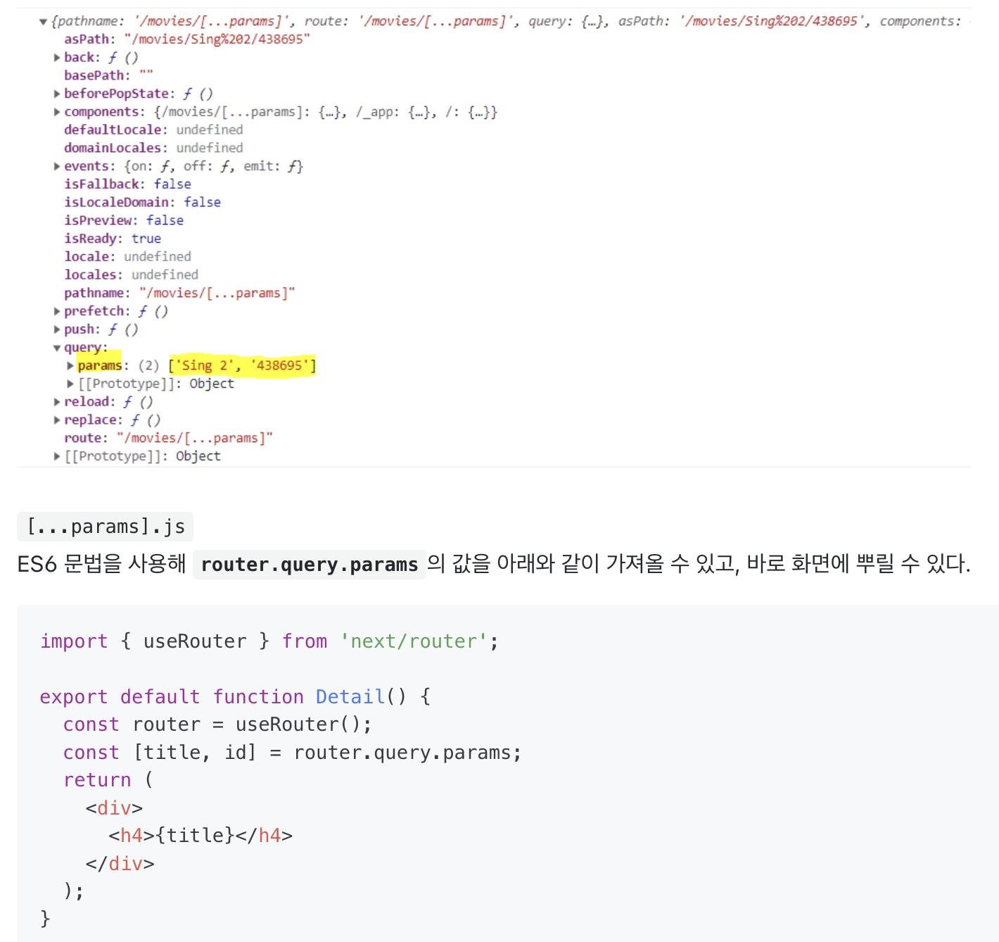
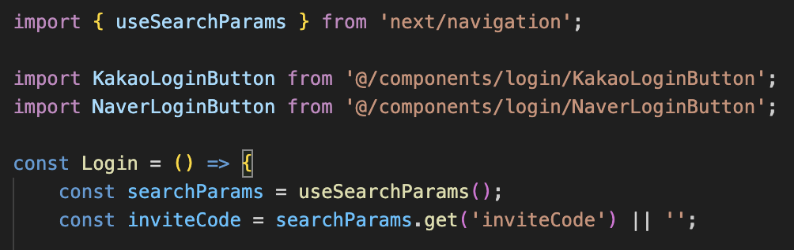

# 11. Next.js 13과 리액트 18

- Next.js 13이 이전과 달라진 점
- 서버 사이드 렌더링 vs 리액트 서버 컴포넌트
---

    2022.10.25 Next 13 출시
    2023.10.26 Next 14 출시
---
## 버전 업데이트 후 변화된 주요 특징
### 1. Routing
    Page Router -> App Router
    *13버전이 등장하며 생긴 큰 변화*

    (이전 버전) pages/ 디렉토리에 파일들을 생성하며 페이지 구성해옴
    (13버전 이후) app/ 디렉토리를 제공하며, 추가적인 기능들을 제공하여 라우팅 방식의 변화 보여줌

    [추가적인 기능]
    1. layout 
    2. Server Component
    3. Streaming



- `app/ ` 디렉토리의 하위 폴더들 = 라우팅
- 각각의 폴더들은 `layout` 파일을 가질 수 있는데, 이는 사이드바와 같이 페이지 이동이 있어도 유지하고 싶은 경우 (페이지의 기본적인 레이아웃을 구성)
    - layout이 있는 **하위** 폴더 및 주소에 모두 영향을 미친다. 
```javascript
import {ReactNode} from 'react'

export default function BlogLayout({children}:{children:ReactNode}) {
    return <section>{children}</section>
}
```
children에 하위 폴더의 컴포넌트들 들어감
- `page` 파일 : 상위 폴더명의 라우팅으로 나타나는 페이지
    - **page가 받는 props**
    - params : 동적 라우트 파라미터를 사용할 경우 해당 파라미터에 값이 들어온다.
    
    이렇게 파일명을 [] 로 감싸면, 동적 라우트를 만들 수 있다.
    /movies/1, /movies/2, /movies/3 ... 가능<br>
    params를 통해 1, 2, 3 가져올 수 있음<br>
    [...params] : /movies/a/b/c ... 여러개 붙일 수 있음<br>
    params를 통해 [a,b,c] 가져올 수 있음 
    
    - searchParams
    

## 리액트 서버 컴포넌트
### SSR vs RSC
SSR : 서버에서 DOM을 만들어오고, 클라이언트에서는 이렇게 만들어진 DOM을 기준으로 하이드레이션 진행

응답받은 페이지 전체를 HTML로 렌더링하는 과정을 서버에서 수행한 후 그 결과를 클라이언트에 내려준다. -> 클라이언트에서 하이드레이션 과정을 거쳐 서버의 결과물을 확인하고 이벤트를 붙이는 등의 작업 수행

* 하이드레이션 : 렌더링과 비슷

SSR의 장점 : 클라이언트에서 내려받아야 하는 자바스크립트의 양이 줄어들어 브라우저의 부담을 덜 수 있다.

RSC : 초기에 인터랙션은 불가능하지만, 정적인 HTML을 빠르게 내려줌

RSC의 장점 : 클라이언트 및 서버 컴포넌트를 빠르게 보여줄 수 있음

    SSR과 RSC의 궁극적인 차이점은 **렌더링**의 유무

서버 컴포넌트
- 요청이 오면 그 순간 서버에서 딱 한번 실행될 뿐이므로 상태를 가질 수 없다. (useState, useReducer 등의 훅 사용할 수 없다)
- 한번 렌더링되면 그걸로 끝 (useEffect, useLayoutEffect 사용할 수 없다)
- 브라우저에서 실행되지 않고 서버에서만 실행되므로 DOM API, window, document 등에 접근할 수 없다. 
- 서버에만 있는 데이터를 async/await로 접근 가능

클라이언트 컴포넌트
- 브라우저 환경에서만 실행되므로 **서버 컴포넌트를 불러오거나**, 서버 전용 훅이나 유틸리티를 불러올 수 없다. (서버 컴포넌트 import 불가)
- 서버 컴포넌트가 클라이언트 컴포넌트를 렌더링하는데, 그 클라이언트 컴포넌트가 자식으로 서버 컴포넌트를 갖는 구조는 가능 (클라이언트 입장에서 봤을 때 이미 서버에서 만들어진 트리를 보여주기만 하므로)

공용 컴포넌트
- 서버와 클라이언트 모두에서 사용 가능

리액트는 모든 것을 다 공용 컴포넌트로 판단한다. 모든 컴포넌트를 다 서버에서 실행 가능한 것으로 분류한다.

클라이언트 컴포넌트라는 것을 명시적으로 선언하려면? `"use client"` 작성
