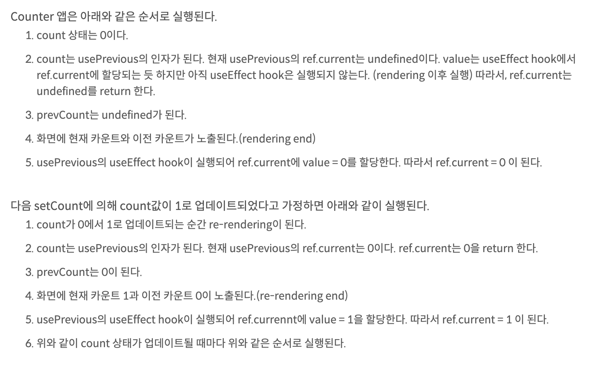

# 03 리액트 훅

훅이 등장한 이래로 리액트는 함수 컴포넌트로 작성되고 있을 정도로 많은 사랑을 받고 있다. 우리가 쓰곤 있었지만 별 생각없이 썼던 리액트 훅에 대해서 정리해보자.

## 3.1.1 useState

### 한 줄 요약

```
useState는 함수 컴포넌트 내에서 상태를 정의하고, 이 상태를 관리할 수 있게 하는 훅이다.
```

### 기본적인 사용법

```js
const [state, setState] = useState(initialState);
```

### 특징

- 훅에 아무런 값을 넘겨주지 않으면 초기값은 undefiend이다.
- useState의 반환 값은 배열이며, 배열의 첫번쨰 원소는 state값 자체, 두번째 원소는 state를 변경하는 함수이다.

```javascript
import { useState } from "react";
const [state, setState] = useState(initialState);
```

### 참고) 리액트에서 렌더링이 일어날 때 회기!

1. 컴포넌트 내에서 `상태`가 바뀔 때 , 즉 useState에서 Setter함수를 통하여 상태를 변경할 리렌더링이 일어난다.
2. props가 바뀔 때
3. 부모 컴포넌트가 렌더링 될 떄

### 💡새로 배운점💡

useState의 인수로 원시 값 (boolean, Number..) 만 넣었는데
`게으른 초기화` 를 통해 useState의 인수로 특정한 값을 넘기는 함수를 인수로 넣어줄 수가 있다.

`useState의 초기값이 복잡하거나 무거운 연산을 포함`하고 있을 때 사용하라고 리액트 공식 문서에서 얘기한다.

example

```javascript
//일반적인 사용
const [count, setCount] = useState(
  Number.parseInt(window.localStorage.getItem(cacheKey))
);

// 게으른 초기화

const [counst, setCount] = useState(() => {
  return Number.parseInt(window.localStorage.getItem(cacheKey));
});
```

게으른 초기화는 state가 `처음 만들어질 떄`만 사용된다. 즉, 리렌더링이 발생할시 이 함수의 실행은 무시된다.

**⭐️결론** <br/>

게으른 초기화는 리액트에서 무거운 연산이 요구될 때, localStorage나 sessionStorage에 대한 접근, map, filter find 같은 배열에 대한 접근, 혹은 초깃값 계산을 위해 함수 호출이 필요할 때와 같이 무거운 연산을 포함해 실행 비용이 많이 드는 경우에 사용하는 게 좋다!

## 3.1.2. useEffect

useEffct의 많은 정의들, 그러나 정확 ❌

1. useEffect는 두 개의 인수를 받는데, 하나는 콜백 함수, 두번째는 의존성 배열이다. 이 두번째 의존성 배열의 값이 변경되면 첫번째 인수인 콜백을 실행한다.

2. 생명주기 메서드와 비슷한 작동을 구현할 수 있다.
3. useEffect는 클린업 함수를 반환할 수 있는데, 컴포넌트가 언마운트 된 후 실행된다.

### 정확한 정의

```markdown
useEffect는 애플리케이션 내 컴포넌트의 여러 값들을 활용해
동기적으로 **부수 효과** 를 만드는 매커니즘이다.
```

- useEffect는 생명주기 메서드를 대체 하기 위해 만들어진 훅이 아니다.

### 기본적인 사용법

```js
function Component() {
  useEffect(() => {}, [props, state]);
}
```

### 부수 효과를 만드는게 뭘까 ?

```js
function Component() {
  const counter = 1;

  const handleClick = () => {
    setCount((prev) => prev + 1);
  };

  //   useEffect(() => {
  //     console.log(counter);
  //   });

  return (
    <>
      <h1>{counter}</h1>
      <button onClick={handleClick}>+</button>
    </>
  );
}
```

이 예제에서 보다시피, `useEffect` 는 의존성에 있는 값을 보면서 의존성의 값이 이전과 다른 게 하나라도 있다면 부수 효과를 실행하는 평범한 함수이다.

### 주의사항

1. `eslint-disblae..` 주석 자제하자.

```
useEffect 내부에서 사용하는 값 중 의존성 배열이 포함되지 않을 때, 경고가 발생되는데, 위에 걸 쓰면 경고가 안나옴.
```

2. 첫번째 인수에 `무기명 함수`가 아닌 `기명 함수` 를 통해 역할을 나타내보자.

함수명을 부여하는 것이 어색해 보일 수 있지만, useEffet의 목적을 명확히 하고 그 책임을 최소한으로 좁힌다는 점에서 굉장히 유용하다(?).고 한다.

3. 거대한 useEffect 노노

4. 불필요한 외부 함수 만들기 ㄴㄴ useEffect 내부에서 정의해서 쓰자 (의존성 배열에 함수 추가해야하니..)

## 3.1.3 useMemo

### 한 줄 요약

`useMemo`는 비용이 큰 연산에 대한 결과를 메모이제이션하여, 저장된 값을 반환하는 훅이다. (최적화할 때 가장 먼저 언급된다!)

### 사용 방법

1. 첫번째 인수 - `값`을 반환하는 `생성 함수` <br/>
2. 두번째 인수 - 해당 함수가 의존하는 값의 배열

```js

// 단순히 값만 메모이제이션 하는 것이 아닌, 컴포넌트도 가능하다.
// 물론 React.memo 스는 게 현명하다.
const MemorizedComponent = useMemo(()=><ExpensiveComponent value={value}>, [value] )
```

## 3.1.4 useCallback

### 한 줄 요약

`useCallback` 은 인수로 넘겨받은 콜백 자체를 기억한다. 특정 함수를 새로 만들거나 하지 않고, 재사용한다는 뜻이다.
`useMemo` 는 값을 기억하고, `useCallback` 은 콜백 자체를 기억한다.

### 사용 방법

`useCallback`의 `첫번째 인수`로 `함수`를 ,`두번쨰 인수`로 `의존성 배열`을 집어 넣으면 `useMemo`와 마찬가지로 `의존성 배열`이 변경되지 않는 한 함수를 재생성하지 않음.

### 왜 필요한거임?

리렌더링 될 떄 컴포넌트 안에 함수가 재성성되고, 리액트에서 props이 변경되었을 때는 `Object.is` 를 사용하게 되는데 이때 함수는 객체이고, 얕은 비교를 하기 때문에 함수 안 내용이 똑같더라도 재생성될 때 가르키는 주소가 달라지게 된다.

### 참고

두 개는 동일하다. (함수 또한 값으로 표현될 수 있으므로)
but 함수 메모이제이션 용도로는 `useCallback` 사용 ㄱㄱ

```js
useCallback(() => {
  console.log("hello");
}, []);

useMemo(() => {
  return () => {
    console.log("hello");
  };
}, []);
```

## 3.1.5 useRef

### `useState`와의 공통점

컴포넌트 내부에서 렌더링이 일어나도 변경 가능한 상태값을 저장한다.

### `useRef`의 고유한 기능

1. `useRef`는 반환값인 객체 내부에 있는 `current`로 값에 접근 또는 변경할 수 있다.

2. `useRef`는 그 값이 변하더라도 `렌더링을 발생시키지 않는다`.

### 함수 외부 변수 선언과의 차이점

- 외부 변수 사용의 경우, 컴포넌트 실행 전에 value값이 `메모리 상에 불필요하게 존재` 한다.

- 컴포넌트가 여러 번 생성되었을 때, 각 컴포넌트에서 가리키는 값이 value로 동일함.

-> useRef는 `컴포넌트가 렌더링 될때만` 생성되고, 컴포넌트 인스턴스가 여러개여도 각각 `별개의 값` 을 바라본다.

### 언제 유용하나요?

**렌더링을 발생시키지 않고 원하는 상태값을 저장하고 싶을 때** 사용하자!!!

1. 이전의 상태를 반환하는 usePrevious 훅을 구현

```js
function usePrevious(value) {
  const ref = useRef();
  useEffect(() => {
    ref.current = value;
  }, [value]);
  return ref.current;
}


function SomeComponent (){
  const [counter ,setCounter] = useState(0);
  const previousCounter = usePrevious (counter);
  const handleClickButton = ()=>{
    setCounter ((prev)=>prev+1);
  }
  return (
    <button onClick={handleClickButton}>
    </button>
  )
}

```

위에 usePrevious 훅을 이해해봅시다. 


사실사 이거 이해하면 useRef 랑 useEffect 이해끝 ㅇㅇㅇㅇ


## 3.1.6