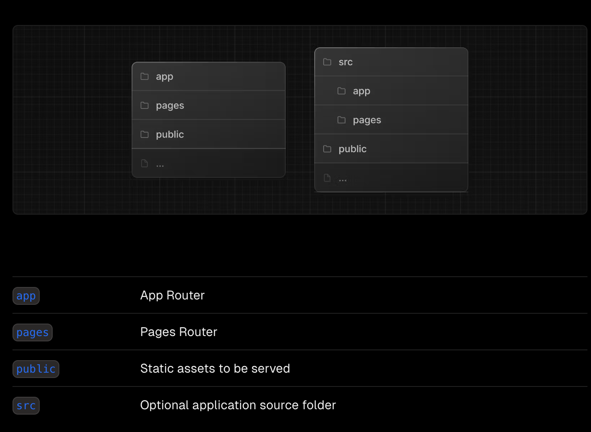
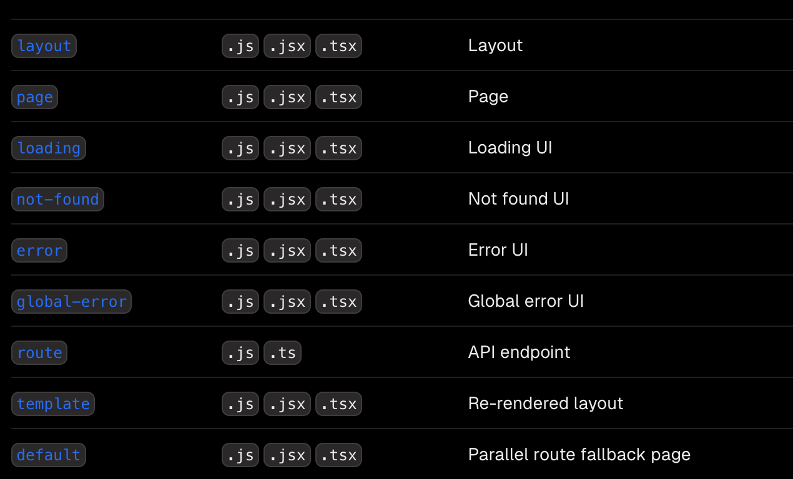
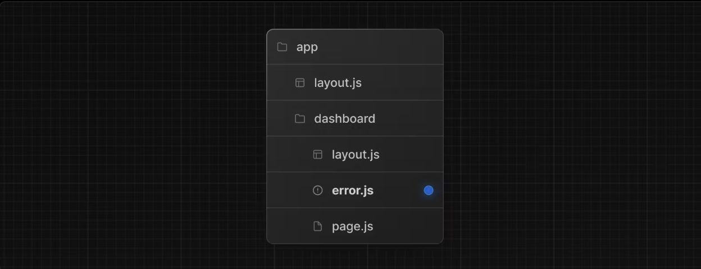
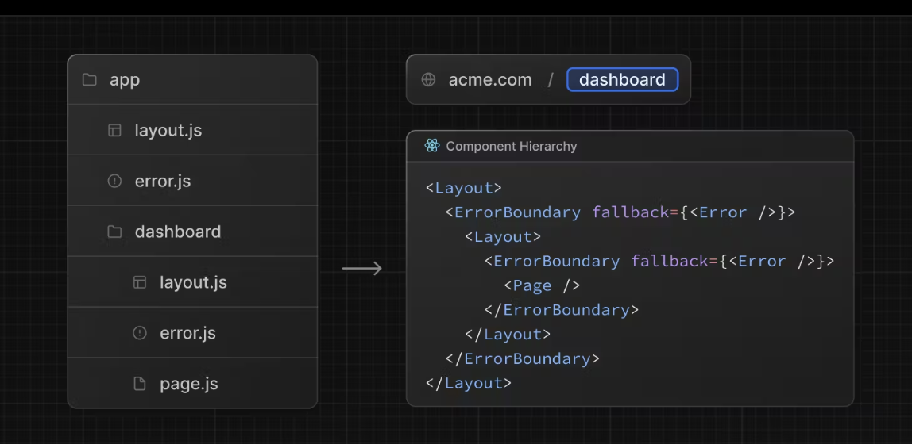

# Next.js 알아보기

```
공식문서를 통해 Next.js 의 기본 기능들에 대해 알아보자!
```

## Next.js란?

Next.js는 `풀스택 웹 애플리케이션`을 구축하기 위한 `React 프레임워크`입니다. 사용자 인터페이스를 구축하려면 `React 컴포넌트`를 사용하고, `추가 기능`과 `최적화`를 위해서는 `Next.js`를 사용합니다.

내부적으로 `Next.js`는 `번들링`, `컴파일` 등과 같이 React에 필요한 툴링을 추상화하고 자동으로 구성합니다. 따라서 구성에 시간을 소비하는 대신 `애플리케이션을 빌드`하는 데 집중할 수 있습니다.

개인 개발자이든 대규모 팀의 일원이든, `Next.js`는 대화형, 동적, 빠른 React 애플리케이션을 구축하는 데 도움이 될 수 있습니다.

## 메인 기능

라우팅

```
 레이아웃, 중첩 라우팅, 로딩 상태, 오류 처리 등을 지원하는 서버 컴포넌트 위에 구축된 파일 시스템 기반 라우터입니다.
```

렌더링

```
클라이언트 및 서버 컴포넌트를 사용한 클라이언트 측 및 서버 측 렌더링. 서버의 정적 렌더링과 동적 렌더링은 Next.js를 통해 더욱 최적화됩니다. Edge 및 Node.js 런타임에서 스트리밍.
데이터 불러오기 서버 컴포넌트의 비동기/대기 기능을 통해 데이터 불러오기를 간소화하고 요청 메모화, 데이터 캐싱 및 재검증을 위한 확장된 불러오기 API를 제공합니다.
```

스타일링

```
 CSS 모듈, Tailwind CSS, CSS-in-JS 등 선호하는 스타일링 방식을 지원합니다.
```

{최적화

```
 이미지, 글꼴 및 스크립트 최적화를 통해 애플리케이션의 핵심 웹 바이탈 및 사용자 경험을 개선합니다.
```

TypeScript

```
 더 나은 타입 검사 및 더 효율적인 컴파일, 사용자 지정 TypeScript 플러그인 및 타입 검사기를 통해 TypeScript에 대한 지원이 개선되었습니다.
```

## App Router와 page Router

Next.js에는 `앱 라우터`와 `페이지 라우터`라는 두 가지 라우터가 있습니다.

`앱 라우터`는 `서버 컴포넌트` 및 `스트리밍`과 같은 React의 최신 기능을 사용할 수 있는 `최신 라우터`입니다.

`페이지 라우터`는 서버 렌더링된 React 애플리케이션을 빌드할 수 있게 해주는 `오리지널 Next.js 라우터`로, 이전 Next.js 애플리케이션에 대해 계속 지원됩니다.

### 시작!

1. `create-next-app` 을 통하여 next.js 실행
2. `npm run dev` 를 통해 개발 모드 실행

## Next 프로젝트 디렉토리 어케짬?



app router 이용 시 app 폴더 안에 들어갈 파일 이름과 역할


## Next.js에서의 라우팅

Next.js는 폴더가 경로를 정의하는 데 사용되는 파일 시스템 기반 라우터를 사용합니다.

각 폴더는 URL 세그먼트에 매핑되는 경로 세그먼트를 나타냅니다. 중첩 경로를 만들려면 폴더를 서로 안에 중첩할 수 있습니다.


경로 세그먼트의 특수 파일에 정의된 React 컴포넌트는 특정 계층 구조로 렌더링됩니다.


layout.js

template.js

error.js (React 에러 경계)

loading.js (React 서스펜스 경계)

not-found.js (React 에러 경계)

page.js 또는 중첩된 layout.js


특수 파일 외에도 컴포넌트, 스타일, 테스트 등 자체 파일을 앱 디렉터리의 폴더에 배치할 수 있습니다.

폴더가 경로를 정의하는 반면, page.js 또는 route.js가 반환하는 콘텐츠만 공개적으로 주소를 지정할 수 있기 때문입니다.

### Linking and Navigating

- Using the `<Link> Component`
- Using the useRouter hook (`Client Components`)
- Using the redirect function (`Server Components`)
- Using the native History API

### SSR

1. 먼저 지정된 페이지에 대한 모든 데이터를 서버에서 가져옵니다.
2. 그런 다음 서버에서 해당 페이지의 HTML을 렌더링합니다.
3. 페이지의 HTML, CSS 및 JavaScript가 클라이언트로 전송됩니다.
4. 생성된 HTML과 CSS를 사용해 비대화형 사용자 인터페이스가 표시됩니다.
5. 마지막으로 React는 사용자 인터페이스에 수분을 공급하여 대화형 인터페이스로 만듭니다.

## Error

경로 세그먼트에서 error.js 추가해서 오류처리할수있습니다 ㄷㄷ



특수 파일을 통해 생성된 React 컴포넌트는 특정 중첩 계층 구조로 렌더링됩니다.



예를 들어 layout.js 파일과 error.js 파일이 모두 포함된 두 개의 세그먼트가 있는 중첩된 경로는 다음과 같은 단순화된 컴포넌트 계층 구조로 렌더링됩니다:


## Streaming 

이러한 단계는 순차적이고 차단적이므로 서버는 모든 데이터를 가져온 후에만 페이지의 HTML을 렌더링할 수 있습니다. 그리고 클라이언트에서는 페이지의 모든 컴포넌트에 대한 코드가 다운로드된 후에만 React가 UI에 수분을 공급할 수 있습니다.

React 및 Next.js를 사용한 SSR은 사용자에게 비대화형 페이지를 최대한 빨리 표시하여 체감 로딩 성능을 개선하는 데 도움이 됩니다.

## Data Fetch

`Next.js`에서 Data fetch 방식에는 4가지가 있습니다.

1. 서버에서 fetch 사용
2. 서버에서, 다른 라이브러리 사용
3. 클라이언트에서 `route handler`를 통해
4. 클라이언트에서, 다른 라이브러리 사용.

Next.js는 네이티브 fetch 웹 API를 확장하여 서버의 각 fetch 요청에 대한 캐싱 및 재검증 동작을 구성할 수 있도록 합니다. React는 fetch를 확장하여 React 컴포넌트 트리를 렌더링하는 동안 fetch 요청을 자동으로 메모화합니다.

서버 컴포넌트, 라우트 핸들러, 서버 액션에서 async/await과 함께 fetch를 사용할 수 있습니다.

캐싱은 데이터를 저장하므로 요청할 때마다 데이터 소스에서 데이터를 다시 가져올 필요가 없습니다.

기본적으로 Next.js는 서버의 데이터 캐시에 가져오기 반환값을 자동으로 캐싱합니다. 즉, 빌드 시간 또는 요청 시간에 데이터를 가져와서 캐시한 후 각 데이터 요청에 재사용할 수 있습니다.
