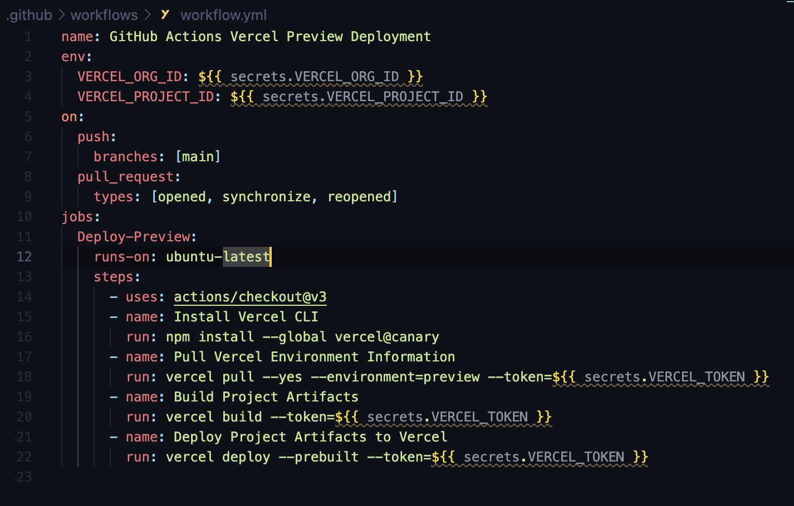

# Chapter 9-2

## CI? 
```
CI = Continuous Integration.
```


코드의 변화를 모으고 관리하는 중앙 저장소에서, 여러 기여자가 기여한 코드를 지속적으로 빌드하고 테스트해 코드의 정합성을 확인하는 과정을 바로 `CI` 라고 한다.

과거엔 `Jenkins` 많이 썼는데, 귀찮기 때문에 깃허브 저장소를 기반으로 깃허브에서 발생하는 다양한 이벤트를 트리거 삼아 작업을 할 수 있게 도와주는  `Github action` 를 써보는 게 좋을 거 같다. 


## 깃허브 액션의기본 개념 


`러너` : 깃허브 액션이 실행되는 서버 

`액션`: `러너`에서 실행되는 하나의 작업 단위를 의미, yaml 파일로 작성된 내용을 하나의 액션으로 볼 수 있음

`이벤트`: 깃허브 액션을 트리거하는 이벤트를 의미
- pull request  , iuuses, push, scehdule .. 이런 게 모두 이벤트이다.

`jobs` : 하나의 러너에서 실행되는 여러 스텝의 모음. 하나의 액션에 여러 잡을 설정할 수 있음. 여러 개일 경우, 이 작업은 병렬로 실행됨

`steps` : 잡 내부에서 일어나는 하나하나의 작업을 의미. 이 작업은 병렬로 실행 X


## 깃허브 액션 작성법 

깃허브 액션을 작성하려면 저장소 루트에 `.github/workflows` 폴더를 생성하고 내부에 파일을 작성하면 된다. 파일명은 마음대로 지정할 수 있으며 파일 확장자를 `.yml` 또 `.yaml`로 지정해야 한다.


`프로젝트 디렉토리 구조` 


`workfllows.yml`





### Q. 이 workflows 파일을 처음에 어떻게 귀찮게 작성하냐..?


Actions 들어가서 template 선택하면 됩니다.


내가 


### VERCEL + Github Action 을 통하여 CI / CD 환경을 구축


`env`에는 vercel에서 내가 생성한 프로젝트에 접근할 수 있게,`Github-settings-secret keys and variables`에 설정해준 변수명을 secrets.{변수명} 형식으로 불러왔다.

여기서 사용한 `VERCEL_ORG_ID` 와 `VERCEL_PROJECT_ID` 를 얻는 방법은,

프로젝트 내에서 npm install vercel@latest을 통해 Vercel 모듈 다운로드를 한 후, 
```
vercel login
vercel (VERCEL CLI 설치)
```
을 통해 먼저 현재 디렉토리 내에서 vercel로 배포를 하고,
이 과정에서 `.vercel` 폴더가 생기는데, 여기에서 `project.json` 파일을 보면 `VERCEL_ORG_ID` 와 `VERCEL_PROJECT_ID` 의 value를 확인할 수 있다!

`on-push-branch:[main]` 은 main 브랜치로 push `이벤트`를 발생할 때 `액션`을 실행하거나 3가지 종류의 `pull_request` 이벤트가 발생할 경우 경우 `액션`을 실행하겠다라는 뜻이다.

`jobs` 의 경우에는 실행할 액션에 대해서 명시한 것인데, `jobs-run-on` 은 액션을 실행시키는 Runner의 운영체제를 뜻하며 `steps`의 경우에는 실행할 액션을 단계별로 구분해놓은 단계이다. 

여러 가지 `stpes`들 중 vercell에 pull하는 단계를 살펴보면, `secrets.VERCEL_TOKEN`을 찾아볼 수 있는데, https://vercel.com/account/tokens 에서 토큰을 발급받아서 위에서 환경변수를 저장한 방식과 동일하게 등록하면 된다.